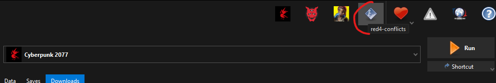
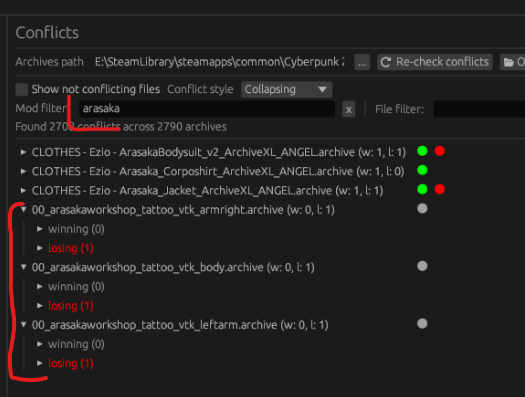
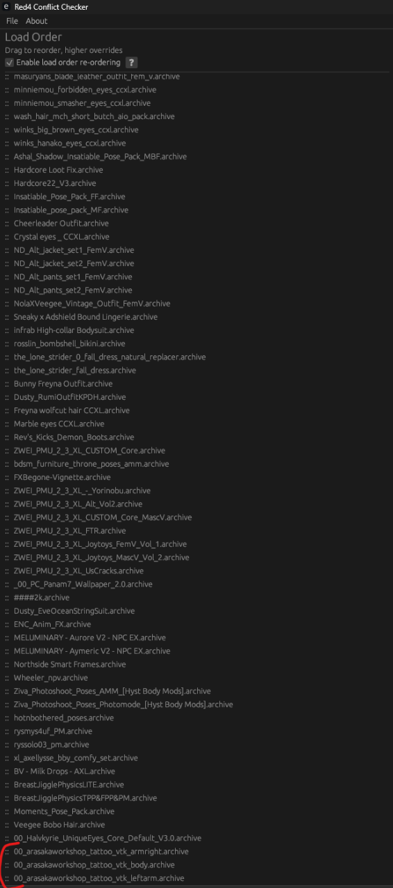
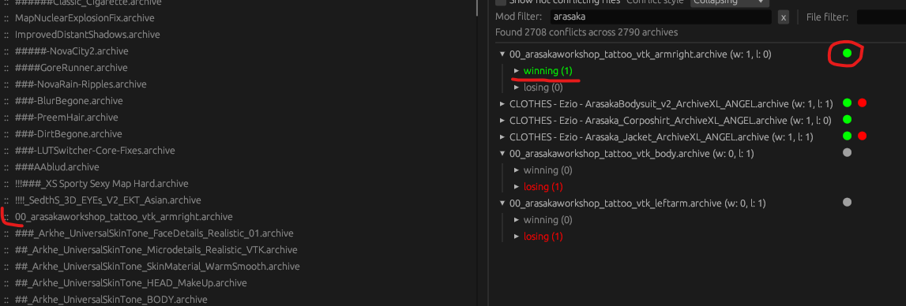
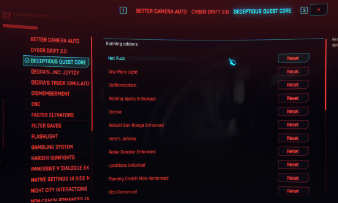

[ <a href="https://github.com/Gallahorn/Ultraviolence/blob/main/README.md">Getting Started</a> ]
[ <a href="https://github.com/Gallahorn/Ultraviolence/blob/main/Installation.md">Installation</a> ]
[ <a href="https://github.com/Gallahorn/Ultraviolence/blob/main/PostInstall.md">After Install</a> ]
[ <a href="https://github.com/Gallahorn/Ultraviolence/blob/main/ModSetup.md">Mod Setup</a> ]
[ Advanced Features ]
[ <a href="https://github.com/Gallahorn/Ultraviolence/blob/main/Gameplay.md">Gameplay</a> ]
[ <a href="https://github.com/Gallahorn/Ultraviolence/blob/main/CommonIssues.md">Common Issues</a> ]

# Advanced Features
In this document you will find instructions on updating the modlist, how to enable certain features and many more useful infos about the list and included mods and their settings.

# Contents
- [Advanced Features](#advanced-features)
- [Contents](#contents)
- [1 How to update the list:](#1-how-to-update-the-list)
  - [1.1 Before you update your list](#11-before-you-update-your-list)
  - [1.2 Updating your list](#12-updating-your-list)
  - [1.3 Update an existing save](#13-update-an-existing-save)
- [2 Tattoos and Overlays](#2-tattoos-and-overlays)
  - [2.1 Use default vanilla skin](#21-use-default-vanilla-skin)
  - [2.2 Enable ONE tattoo option](#22-enable-one-tattoo-option)
  - [2.3 Red4-conflicts and load order](#23-red4-conflicts-and-load-order)
- [3 Resetting mods](#3-resetting-mods)
  - [3.1 How to reset Lizzies Braindance](#31-how-to-reset-lizzies-braindance)
  - [3.2 How to reset Deceptious Quest mods](#32-how-to-reset-deceptious-quest-mods)
- [4 Romance Options](#4-romance-options)
  - [4.1 How to Unlock Romance Options](#41-how-to-unlock-romance-options)
- [5 Paired poses](#5-paired-poses)
  - [5.1 How to use paired poses](#51-how-to-use-paired-poses)
- [6 Keybinds and mod configs](#6-keybinds-and-mod-configs)
  - [6.1 Already set Keybinds](#61-already-set-keybinds)
    - [6.1.1 LimitedHud](#611-limitedhud)
    - [6.1.2 Advanced Driving Controls](#612-advanced-driving-controls)
    - [6.1.3 Nitrous](#613-nitrous)
    - [6.1.4 Dark Future](#614-dark-future)
  - [6.2 Optional Keybinds and Mod Configurations](#62-optional-keybinds-and-mod-configurations)
    - [6.2.1 Flashlight](#621-flashlight)
    - [6.2.2 LUT Switcher](#622-lut-switcher)
    - [6.2.3 Main Quest Tracker](#623-main-quest-tracker)

# 1 How to update the list:

## 1.1 Before you update your list
Once you are certain you've backed up what you need (and any character presets you've made!), you can clear out the overwrite folder.

After that you will need to go do [Step 2.1](Installation.md#21-make-a-clean-cyberpunk-installation) in the main readme. Please keep in mind that Step 2.1 ensures you have a clean installation, and includes instructions for backing up your saves.

> [!CAUTION] 
> Very important to do this step to make sure your game folder is clean.

## 1.2 Updating your list
To update your list you just need to start Wabbajack like normal and install the list with the install paths pointing to the current UltraViolence install folder, and the same with the download folder.

> [!WARNING] 
> After you updated the list you might need to re-order your tattoos or overlays again. Check [below](#2-tattoos-and-overlays) for instructions.

## 1.3 Update an existing save
If you are using an existing save, go back to V's original H10 apartment, to reactivate and make sure Lizzies Braindance and Romance messages Extended are working.
After each update, go back to the H10 (V's original apartment) and you should see a popup about Lizzies Braindances, and other mods that activate upon entering this zone, _if those mods have updated_. Enter the apartment, turn on the TV, and you should receive messages about Judy Romance Messages Extended and Panam Romance Messages Extended. If this doesn't happen, leave the apartment and re-enter just to be sure, but it is also the case that these messages will not display if none of the mods have updated with the list update.

# 2 Tattoos and Overlays

The list currently supports VTK overlays but you can only have ONE active at the time and to change it you will need to do the following steps.

## 2.1 Use default vanilla skin
For overlays, the vanilla version of UNIVERSAL SKIN TONE must be selected; other options produce visual errors when used with overlays.  

## 2.2 Enable ONE tattoo option
Find the tattoo you like and check it in MO2.  
For any mod, you can right-click, and select 'Visit on Nexus' to view the mod on Nexus.  
The name of the mod will correspond to a specific file from the mod's page.  

## 2.3 Red4-conflicts and load order
- First enable the overlay you want to use under Body Replacers (Tattoo’s, Overlays)
- Second right click and click on “Informations…”
- change to Filetree and look up what the overlays are named and note it down.  

- Then you click in the top right corner on red4-conflicts to start the app  

- when red4 opens you will search for the name of the overlay/mod in the mod filter window and see what they are losing to like this  

- then find the mods on the load order panel (should be at the bottom of the list)  

- Then move the mod one at the time till they on the right pan say they are winning and the red dot turns green.  

# 3 Resetting mods

## 3.1 How to reset Lizzies Braindance
Sometimes after an update you will need to reset Lizzie's Braindance.  
If you can't find the NPC for BD inside the Lizzie's, use this CET command to reset the quest:

    Game.GetQuestsSystem():SetFactStr("lizzies_bds_reset", 1)

Then save the game and load the newly created savegame.  
NPC should be available again.

If you don't have any options with the NPC, use this command:

        Game.GetQuestsSystem():SetFactStr("lizzies_bds_active", 0)

## 3.2 How to reset Deceptious Quest mods
If you need to reset any of deceptious mods you have the option to do so in mods menu and under Deceptious quest core category.

You can also stop Loops from happening in certain quests if you want to. 

# 4 Romance Options

## 4.1 How to Unlock Romance Options
The list uses "Non-Canon Romances Enchanced".  
To use it go to the mod menu and then select NCRE menu and select the partners you want to unlock.
    

# 5 Paired poses

## 5.1 How to use paired poses
First open Photomode, place your V and pick a pose mod that supports pair poses.  
Normally they are named FF,MF,MBF. Pick the right one for the right npc you are planing on pairing with.  
FF  = Female/Female  
MF  = Male/Female  
MBF = Malebig/female  

Then you click the Characters menu and pick the npc you want to pair with.  

Then you find the same pose pack and find the paired pose for the V pose you picked.  
The paired poses are named a bit different from pack to pack so you will need to figure that one out.  
Then match the position to the same numbers as V are positioned and they should match up.  
  

> [!TIP]
> A video tutorial about Photomode and paired poses is available [here](https://www.youtube.com/watch?v=Pvdd5uelh8U ).

# 6 Keybinds and mod configs

## 6.1 Already set Keybinds

### 6.1.1 LimitedHud
- F6 to show/hide minimap
- F8 to show/hide UI after your settings.

### 6.1.2 Advanced Driving Controls
This mod makes the driving a lot smoother and more controller like.

- General:
  - V to switch seat
  - Y to switch Driving AI (recommend Modded Normal AI)
- Cars:
  - Accelerate slower with just W.
  - Acclerate Faster With LShift.
  - Brake slower with S.
  - Brake faster with LCTRL.
- Bikes:
  - Accelerate slower with just W.
  - Acclerate Faster With LShift.
  - Brake slower with S.
  - Brake faster with LCTRL.
  - Lean Forward with UP (You need to rebind to UP, as LShift doesn't work anymore).
  - Lean Backward with DOWN (You need to rebind to DOWN, as LCTRL doesn't work anymore).

### 6.1.3 Nitrous
Left Alt - Nitrous boost

### 6.1.4 Dark Future
B - Show current status for Dark Future

## 6.2 Optional Keybinds and Mod Configurations
Use CET for most mod related keybinds. Keep in mind that there are two mod configuration menus in the ESC menu, 'Mods' and 'Mod Settings'. Settings for any mod will be in one of these three places.

### 6.2.1 Flashlight
Some of the graphical mods change the lighting you might be used to from Vanilla, and depending on your choice of LUT, certain areas of the game may be very dark. The flashlight can be toggled with a binding you set in CET. The flashlight can also be configured for greater brightness, angle, and its color can be changed. Flashlight settings are found in `ESC->Mods->Flashlight` (if you don't see it, scroll on the top through the tabs).  

### 6.2.2 LUT Switcher
LUT Switcher, found in CET, allows you to select from the many different LUTs available, and bind hotkeys for switching in game and photo mode. LUT Switcher's own instructions are also attached to the panel in CET.  

Use the star icons to set favorite LUTs from the listed selections available. Follow the instructions for assigning keys and secondary/menu/photo specific LUTs.  

- Left click a LUT to activate it
- Right click to set a secondary LUT
- Middle click to set a LUT used only in menus
- You can set the LUT switcher keybinds in CET like so, according to these suggestions or to your preference.  

### 6.2.3 Main Quest Tracker
Do you get annoyed when after completing a side objective or reaching a custom map marker, the game will automatically select the main quest marker again? Then this mod and setting are for you. Open CET, and find the collapsed panel for Main Quest Tracker (usually nested and floating near the top of the screen). Check the first box to prevent automatic re-tracking. Other settings pictured may be useful to you.  

The main tracking function toggle can also be set in CET; by default, it should be `Numpad 5`.  

