

[ <a href="https://github.com/Gallahorn/Ultraviolence/blob/main/README.md">Getting Started</a> ]
[ <a href="https://github.com/Gallahorn/Ultraviolence/blob/main/Installation.md">Installation</a> ]
[ <a href="https://github.com/Gallahorn/Ultraviolence/blob/main/PostInstall.md">After Install</a> ]
[ <a href="https://github.com/Gallahorn/Ultraviolence/blob/main/ModSetup.md">Mod Setup</a> ]
[ Advanced Features ]
[ <a href="https://github.com/Gallahorn/Ultraviolence/blob/main/Gameplay.md">Gameplay</a> ]
[ <a href="https://github.com/Gallahorn/Ultraviolence/blob/main/CommonIssues.md">Common Issues</a> ]

# Advanced Features
In this document you will find instructions on updating the modlist, how to enable certain features and many more useful infos about the list and included mods and their settings.

# Contents
- [Advanced Features](#advanced-features)
- [Contents](#contents)
- [1 How to update the list:](#1-how-to-update-the-list)
  - [1.1 Before you update your list](#11-before-you-update-your-list)
  - [1.2 Updating your list](#12-updating-your-list)
  - [1.3 Update an existing save](#13-update-an-existing-save)
- [2 Tattoos and Overlays](#2-tattoos-and-overlays)
  - [2.1 Use default vanilla skin](#21-use-default-vanilla-skin)
  - [2.2 Enable ONE tattoo option](#22-enable-one-tattoo-option)
  - [2.3 Red4-conflicts and load order](#23-red4-conflicts-and-load-order)
- [3 Resetting mods](#3-resetting-mods)
  - [3.1 How to reset Lizzies Braindance](#31-how-to-reset-lizzies-braindance)
  - [3.2 How to reset Deceptious Quest mods](#32-how-to-reset-deceptious-quest-mods)
- [4 Romance Options](#4-romance-options)
  - [4.1 How to Unlock Romance Options](#41-how-to-unlock-romance-options)
- [5 Paired poses](#5-paired-poses)
  - [5.1 How to use paired poses](#51-how-to-use-paired-poses)
- [6 Keybinds and mod configs](#6-keybinds-and-mod-configs)
  - [6.1 Already set Keybinds](#61-already-set-keybinds)
    - [6.1.1 LimitedHud](#611-limitedhud)
    - [6.1.2 Advanced Driving Controls](#612-advanced-driving-controls)
    - [6.1.3 Nitrous](#613-nitrous)
    - [6.1.4 Dark Future](#614-dark-future)
  - [6.2 Optional Keybinds and Mod Configurations](#62-optional-keybinds-and-mod-configurations)
    - [6.2.1 Flashlight](#621-flashlight)
    - [6.2.2 LUT Switcher](#622-lut-switcher)
    - [6.2.3 Main Quest Tracker](#623-main-quest-tracker)
- [7 Advanced Graphics](#7-advanced-graphics)

# 1 How to update the list:

## 1.1 Before you update your list
Once you are certain you've backed up what you need (and any character presets you've made!), you can clear out the overwrite folder.
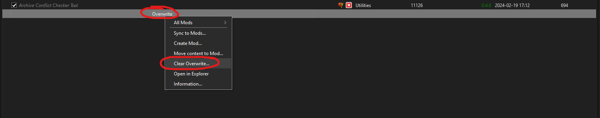

After that you will need to go do [Step 2.1](Installation.md#21-make-a-clean-cyberpunk-installation) in the main readme. Please keep in mind that Step 2.1 ensures you have a clean installation, and includes instructions for backing up your saves.

> [!CAUTION] 
> Very important to do this step to make sure your game folder is clean.

## 1.2 Updating your list
To update your list you just need to start Wabbajack like normal and install the list with the install paths pointing to the current UltraViolence install folder, and the same with the download folder.

> [!WARNING] 
> After you updated the list you might need to re-order your tattoos or overlays again. Check [below](#2-tattoos-and-overlays) for instructions.

## 1.3 Update an existing save
If you are using an existing save, go back to V's original H10 apartment, to reactivate and make sure Lizzies Braindance and Romance messages Extended are working.
After each update, go back to the H10 (V's original apartment) and you should see a popup about Lizzies Braindances, and other mods that activate upon entering this zone, _if those mods have updated_. Enter the apartment, turn on the TV, and you should receive messages about Judy Romance Messages Extended and Panam Romance Messages Extended. If this doesn't happen, leave the apartment and re-enter just to be sure, but it is also the case that these messages will not display if none of the mods have updated with the list update.

# 2 Tattoos and Overlays

The list currently supports VTK overlays but you can only have ONE active at the time and to change it you will need to do the following steps.

## 2.1 Use default vanilla skin
For overlays, the vanilla version of UNIVERSAL SKIN TONE must be selected; other options produce visual errors when used with overlays.  
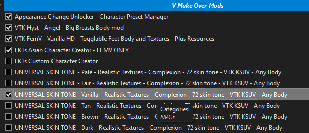

## 2.2 Enable ONE tattoo option
Find the tattoo you like and check it in MO2.  
For any mod, you can right-click, and select 'Visit on Nexus' to view the mod on Nexus.  
The name of the mod will correspond to a specific file from the mod's page.  
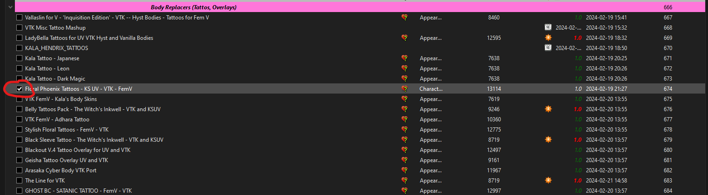

## 2.3 Red4-conflicts and load order
- First enable the overlay you want to use under Body Replacers (Tattoo’s, Overlays)
- Second right click and click on “Informations…”
- change to Filetree and look up what the overlays are named and note it down.  

- Then you click in the top right corner on red4-conflicts to start the app  
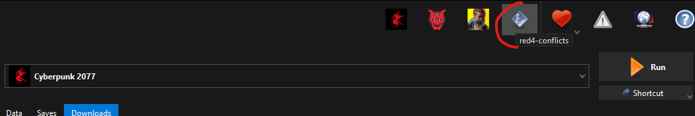
- when red4 opens you will search for the name of the overlay/mod in the mod filter window and see what they are losing to like this  
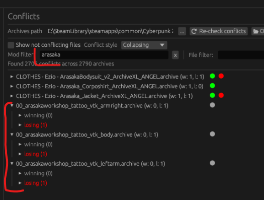
- then find the mods on the load order panel (should be at the bottom of the list)  
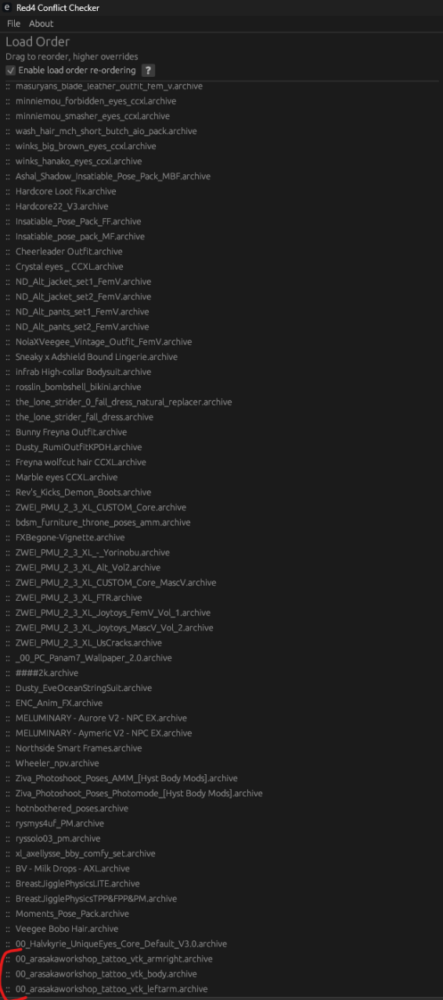
- Then move the mod one at the time till they on the right pan say they are winning and the red dot turns green.  
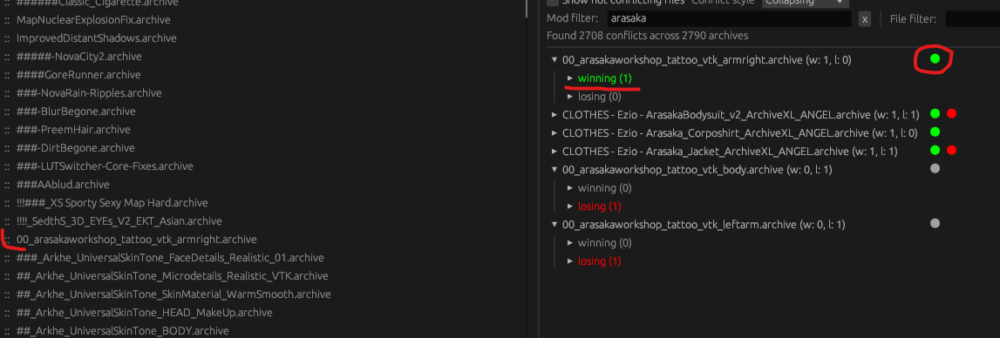

# 3 Resetting mods

## 3.1 How to reset Lizzies Braindance
Sometimes after an update you will need to reset Lizzie's Braindance.  
If you can't find the NPC for BD inside the Lizzie's, use this CET command to reset the quest:

    Game.GetQuestsSystem():SetFactStr("lizzies_bds_reset", 1)

Then save the game and load the newly created savegame.  
NPC should be available again.

If you don't have any options with the NPC, use this command:

        Game.GetQuestsSystem():SetFactStr("lizzies_bds_active", 0)

## 3.2 How to reset Deceptious Quest mods
If you need to reset any of deceptious mods you have the option to do so in `ESC->MCM` under Deceptious quest core.

You can also stop Loops from happening in certain quests if you want to. 
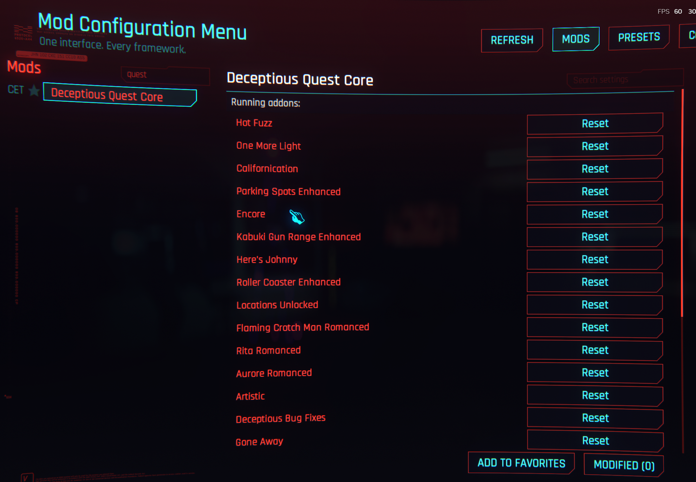

## 4 Romance Options

## 4.1 How to Unlock Romance Options
The list uses "Non-Canon Romances Enchanced".  
You can find its settings in `ESC->MCM`.
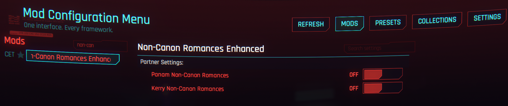    

## 5 Photomode Guide

> [!TIP]
> A video tutorial about Photomode and paired poses is available [here](https://www.youtube.com/watch?v=Pvdd5uelh8U).

How to use the CET NPC selector and NPC Pose selector

## 5.1 Photomode NPC Selector

1. Open up Photomode by pressing the "N" Key.

2. Next open the CET window this will be a hot key you have setup yourself when first starting this modlist.

   

3. Find the window Photomode NPC Selector it should look like this and click on the arrow:

   

4. Once its opened up you can choose up to 6 NPC's to be in your photo scene. 

  

4.1 You can change the NPC's outfits in this menu too click on the drop down box marked in red to choose your outfit.

 

## 5.2 Photomode NPC Pose Selector

1. Open up the CET menu if you closed it and look for the Photomode Pose Selector I have it highlighted here:

 

2. Once open you will see this:

2.1 In this menu you have a lot of options I will list them off here (You Can Click On The Image To Enlarge It):
  
  1. **<ins>Category:</ins>** This button will show you all the pose packs we have in the Modpack.
  2. **<ins>Pose:</ins>** Once you have selected the pose pack in the category menu this menu will let you choose a pose from that pack.
  3. **<ins>Expression:</ins>** This menu will let you choose your PC or NPC's expression.
  4. **<ins>Character Selection:</ins>** This drop down box lets you select your PC and NPC's you have in the scene.
  5. **<ins>Favorites:</ins>** The Star button lets you favorite pose packs and poses so you don't have to go searching for them. Clicking on the favorites box will remove everything but your favorites for easy choosing.
  6. **<ins>Look At Camera:</ins>** This option will let you choose how you want your PC or NPC to face the camera.
  7. **<ins>Position UI:</ins>** This is where you can move both PC and NPC's as if you where in normal Photomode. Keep in mind this is only moving the Characters not the camera you need to leave CET to move the camera.

3. Select your Character then select your pose pack (You will see the Character default to the first pose in the pack):

3.1 Select the pose button then choose your pose:

3.2 Use the Position UI to move the character to how you want them:

3.3 Choose your expression:

## <ins>And thats a basic rundown on how to use the NPC Selector and NPC Pose Selector.</ins>

## 5.3 How To Setup Paired Poses

1. Select the characters you want to use in your pair and then find a pose pack that has paired posing have pairing lettering to let you know its a pair pose pack:
   **<ins>MF:</ins>** Male/Female 
   **<ins>FF:</ins>** Female/Female 
   **<ins>MBF:</ins>** Male Big/Female 
   

2. In this example we will use this pose pack here (Make Sure Both Characters are using the same pose pack):

3.Once you select the poses your characters may not be line up correctly like this:

4. To make the characters pair correctly you need to make sure in the Position UI they are line up exactly the same:

### You may or may not need to fine tune the positioning but that is up too you to do. Hopefully this helps in someway on how to use paired poses.

# 6 Keybinds and mod configs

## 6.1 Already set Keybinds

### 6.1.1 LimitedHud
- F6 to show/hide minimap
- F8 to show/hide UI after your settings.

### 6.1.2 Advanced Driving Controls
This mod makes the driving a lot smoother and more controller like.

- General:
  - V to switch seat
  - Y to switch Driving AI (recommend Modded Normal AI)
- Cars:
  - Accelerate slower with just W.
  - Acclerate Faster With LShift.
  - Brake slower with S.
  - Brake faster with LCTRL.
- Bikes:
  - Accelerate slower with just W.
  - Acclerate Faster With LShift.
  - Brake slower with S.
  - Brake faster with LCTRL.
  - Lean Forward with UP (You need to rebind to UP, as LShift doesn't work anymore).
  - Lean Backward with DOWN (You need to rebind to DOWN, as LCTRL doesn't work anymore).

### 6.1.3 Nitrous
Left Alt - Nitrous boost

### 6.1.4 Dark Future
B - Show current status for Dark Future

## 6.2 Optional Keybinds and Mod Configurations
Use CET for most mod related keybinds. Keep in mind that there are two mod configuration menus in the ESC menu, 'Mods' and 'Mod Settings'. Settings for any mod will be in one of these three places.

### 6.2.1 Flashlight
Some of the graphical mods change the lighting you might be used to from Vanilla, and depending on your choice of LUT, certain areas of the game may be very dark. The flashlight can be toggled with a binding you set in MCM. Flashlight settings are found in `ESC->MCM`.  
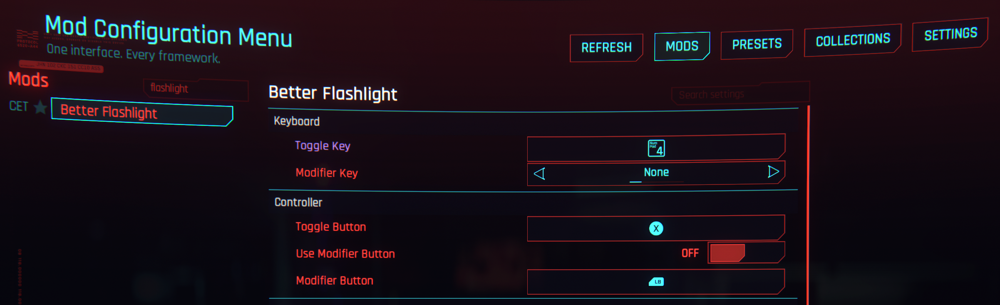

### 6.2.2 LUT Switcher
LUT Switcher, found in CET, allows you to select from the many different LUTs available, and bind hotkeys for switching in game and photo mode.

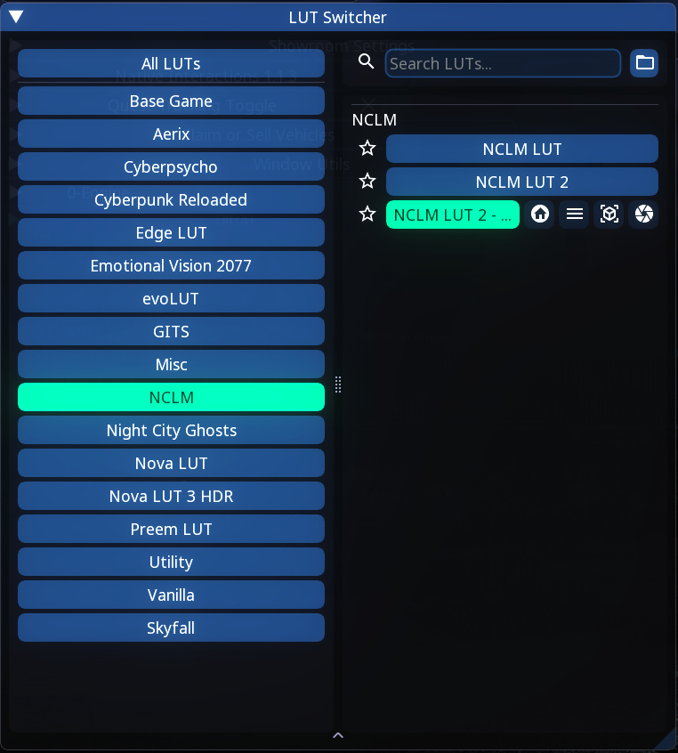

Use the star icons to set favorite LUTs from the listed selections available. Follow the instructions for assigning keys and secondary/menu/photo specific LUTs.

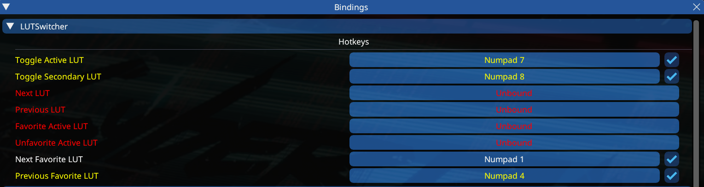

### 6.2.3 Main Quest Tracker
Do you get annoyed when after completing a side objective or reaching a custom map marker, the game will automatically select the main quest marker again? Then this mod and setting are for you. Open CET, and find the collapsed panel for Main Quest Tracker (usually nested and floating near the top of the screen). Check the first box to prevent automatic re-tracking. Other settings pictured may be useful to you.  
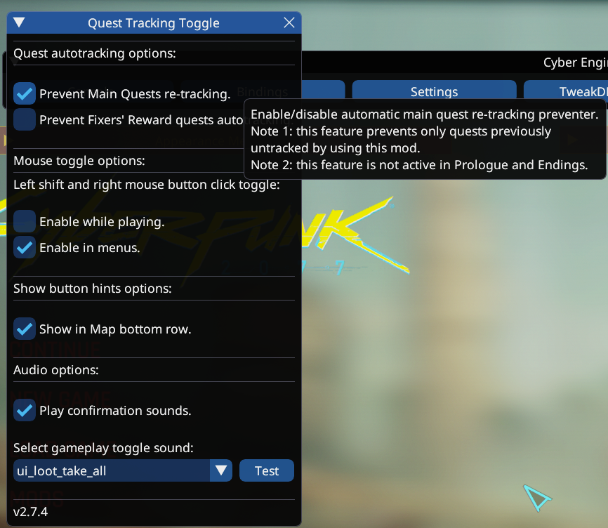

The main tracking function toggle can also be set in CET; by default, it should be `Numpad 5`.  
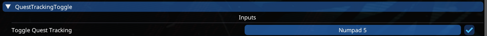

# 7 Advanced Graphics

> [!WARNING]
> These options are meant for experienced users.  
> Make sure that you have already installed and configured the list so it runs properly and smooth before you even try any of these.
> If you don't have at least 16GB of VRAM, don't even think about enabling anything but the default here.
>
> If you start crashing a lot after changing options here it's likely a VRAM crash, try restoring the defaults.

Only one of the different resolutions should be enabled at a time.  
ENV tuner is for experienced users who know what they are doing.  
It is provideed as is, and not excessively tested.
