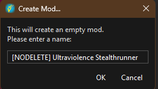
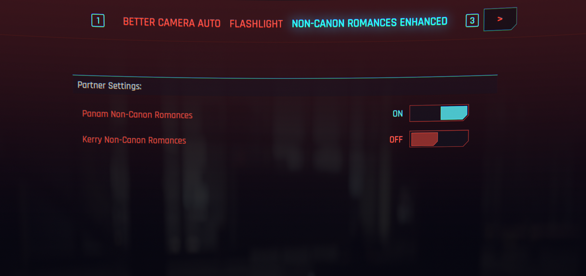
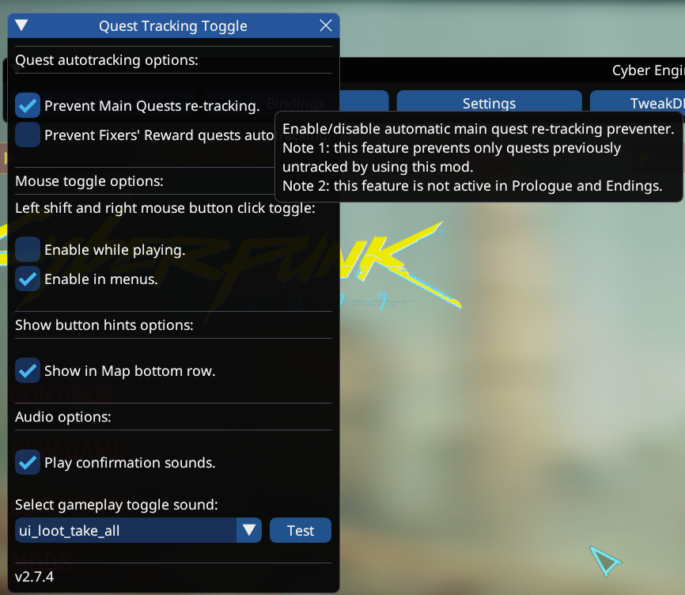

[ <a href="https://github.com/Gallahorn/Ultraviolence/blob/main/README.md">Getting Started</a> ]
[ <a href="https://github.com/Gallahorn/Ultraviolence/blob/main/Installation.md">Installation</a> ]
[ <a href="https://github.com/Gallahorn/Ultraviolence/blob/main/PostInstall.md">After Install</a> ]
[ <a href="https://github.com/Gallahorn/Ultraviolence/blob/main/ModSetup.md">Mod Setup</a> ]
[ Advanced Features ]
[ <a href="https://github.com/Gallahorn/Ultraviolence/blob/main/Gameplay.md">Gameplay</a> ] 

# Advanced Features
In this document you will find instructions on updating the modlist, how to enable certain features and many more useful infos about the list and included mods and their settings.

# Contents
- [Advanced Features](#advanced-features)
- [Contents](#contents)
- [1 How to update the list:](#1-how-to-update-the-list)
  - [1.1 Before you update your list](#11-before-you-update-your-list)
  - [1.2 Updating your list](#12-updating-your-list)
  - [1.3 Update an existing save](#13-update-an-existing-save)
- [2 Tattoos and Overlays](#2-tattoos-and-overlays)
  - [2.1 Use default vanilla skin](#21-use-default-vanilla-skin)
  - [2.2 Enable ONE tattoo option](#22-enable-one-tattoo-option)
  - [2.3 Red4-conflicts and load order](#23-red4-conflicts-and-load-order)
- [3 Resetting mods](#3-resetting-mods)
  - [3.1 How to reset Lizzies Braindance](#31-how-to-reset-lizzies-braindance)
- [4 Romance Options](#4-romance-options)
  - [4.1 How to Unlock Romance Options](#41-how-to-unlock-romance-options)
- [5 Paired poses](#5-paired-poses)
  - [5.1 How to use paired poses](#51-how-to-use-paired-poses)
- [6 Keybinds and mod configs](#6-keybinds-and-mod-configs)
  - [6.1 Already set Keybinds](#61-already-set-keybinds)
    - [6.1.1 LimitedHud](#611-limitedhud)
    - [6.1.2 Advanced Driving Controls](#612-advanced-driving-controls)
  - [6.2 Optional Keybinds and Mod Configurations](#62-optional-keybinds-and-mod-configurations)
    - [6.2.1 Flashlight](#621-flashlight)
    - [6.2.2 LUT Switcher](#622-lut-switcher)
    - [6.2.3 Main Quest Tracker](#623-main-quest-tracker)
    - [6.2.4 Upscaler Options for AMD and older NVIDIA hardware](#624-upscaler-options-for-amd-and-older-nvidia-hardware)

# 1 How to update the list:

## 1.1 Before you update your list
Before you update your list you will need to backup some files from overwrite. The files you need to backup are found in:
- (modlist-path)\overwrite\bin\x64\plugins\cyber_engine_tweaks\mods\StealthRunner\sessions
- (modlist-path)\overwrite\bin\x64\plugins\cyber_engine_tweaks\mods\stocks\data\persistent

These should be backed up in a way that preserves their place in the modlist file paths and will survive the overwriting when Wabbajack updates the list. Create an empty mod inside MO2, and name it like so (the `[NODELETE]` part of the name ensures Wabbajack will not overwrite this folder. Right click on the "Ultraviolence Settings" separator and select `All mods->Create Empty Mod Inside`:

)

Next, create a folder structure inside this mod that duplicates the paths of the data you need to back up. Right click on the mod you've created, and select `Open in Explorer`. Then just create new folders inside to match the expected path. The full structure should look like this:

Now you're ready to move the files from overwrite to the mod you've made. Open the overwrite directory in the same way you did with your mod, right click on "overwrite" and select `Open in Explorer`. Navigate down to the `StealthRunner\sessions` and `stocks\data\persistent` folders, and you should see that they are populated with many *.lua script files. The easiest thing to do is simply copy the `sessions` and `persistent` folders into their matching place in your mod.

The end result is that both folders in your mod should now be populated with the same folders and scripts you saw in overwrite.

Finally, once you are certain you've backed up what you need (and any character presets you've made!), you can clear out the overwrite folder.

After that you will need to go do [Step 2.1](Installation.md#21-make-a-clean-cyberpunk-installation) in the main readme. Please keep in mind that Step 2.1 ensures you have a clean installation, and includes instructions for backing up your saves.

> [!WARNING] 
> Very important to do this step to make sure your game folder is clean.

## 1.2 Updating your list
To update your list you just need to start Wabbajack like normal and install the list with the install paths pointing to the current UltraViolence install folder, and the same with the download folder.

> [!WARNING] 
> After you updated the list you might need to re-order your tattoos or overlays again. Check below for instructions.

## 1.3 Update an existing save
If you are using an existing save, go back to V's original H10 apartment, to reactivate and make sure Lizzies Braindance and Romance messages Extended are working.
After each update, go back to the H10 (V's original apartment) and you should see a popup about Lizzies Braindances, and other mods that activate upon entering this zone, _if those mods have updated_. Enter the apartment, turn on the TV, and you should receive messages about Judy Romance Messages Extended and Panam Romance Messages Extended. If this doesn't happen, leave the apartment and re-enter just to be sure, but it is also the case that these messages will not display if none of the mods have updated with the list update.

# 2 Tattoos and Overlays

The list currently supports VTK overlays but you can only have ONE active at the time and to change it you will need to do the following steps.

## 2.1 Use default vanilla skin
For overlays, the vanilla version of UNIVERSAL SKIN TONE must be selected; other options produce visual errors when used with overlays.  

## 2.2 Enable ONE tattoo option
Find the tattoo you like and check it in MO2.  
For any mod, you can right-click, and select 'Visit on Nexus' to view the mod on Nexus.  
The name of the mod will correspond to a specific file from the mod's page.  

## 2.3 Red4-conflicts and load order
Start red4-conflicts.  

You will need to go to the bottom of the left panel, find your overlays and drag them up to the top like in the second image.   
Currently you can only move the files one at the time.  
The overlays should sit above most files, especially any body or head related files.  
After you moved each of the files, you can close Red4-conflicts and start the game.  
The overlays will always be present on your V, like a layer of skin texture underneath the tattoo options applied in character creator.  

# 3 Resetting mods

## 3.1 How to reset Lizzies Braindance
Sometimes after an update you will need to reset Lizzie's Braindance.  
If you can't find the NPC for BD inside the Lizzie's, use this CET command to reset the quest:

    Game.GetQuestsSystem():SetFactStr("lizzies_bds_reset", 1)

Then save the game and load the newly created savegame.  
NPC should be available again.

If you don't have any options with the NPC, use this command:

        Game.GetQuestsSystem():SetFactStr("lizzies_bds_active", 0)

# 4 Romance Options

## 4.1 How to Unlock Romance Options
The list uses "Non-Canon Romances Enchanced".  
To use it go to the mod menu and then select NCRE menu and select the partners you want to unlock.
    

# 5 Paired poses

## 5.1 How to use paired poses
First open Photomode, place your V and pick a pose mod that supports pair poses.  
Normally they are named FF,MF,MBF. Pick the right one for the right npc you are planing on pairing with.  
FF  = Female/Female  
MF  = Male/Female  
MBF = Malebig/female  

Then you click the Characters menu and pick the npc you want to pair with.  

Then you find the same pose pack and find the paired pose for the V pose you picked.  
The paired poses are named a bit different from pack to pack so you will need to figure that one out.  
Then match the position to the same numbers as V are positioned and they should match up.  

# 6 Keybinds and mod configs

## 6.1 Already set Keybinds

### 6.1.1 LimitedHud
- F6 to show/hide minimap
- F8 to show/hide UI after your settings.

### 6.1.2 Advanced Driving Controls
This mod makes the driving a lot smoother and more controller like.
    
- Cars:
    - Accelerate slower with just W.
    - Acclerate Faster With LShift.
    - Brake slower with S.
    - Brake faster with LCTRL.
- Bikes:
    - Accelerate slower with just W.
    - Acclerate Faster With LShift.
    - Brake slower with S.
    - Brake faster with LCTRL.
    - Lean Forward with UP (You need to rebind to UP, as LShift doesn't work anymore).
    - Lean Backward with DOWN (You need to rebind to DOWN, as LCTRL doesn't work anymore).

## 6.2 Optional Keybinds and Mod Configurations
Use CET for most mod related keybinds. Keep in mind that there are two mod configuration menus in the ESC menu, 'Mods' and 'Mod Settings'. Settings for any mod will be in one of these three places.

### 6.2.1 Flashlight
Some of the graphical mods change the lighting you might be used to from Vanilla, and depending on your choice of LUT, certain areas of the game may be very dark. The flashlight can be toggled with a binding you set in CET. The flashlight can also be configured for greater brightness, angle, and its color can be changed. Flashlight settings are found in `ESC->Mods->Flashlight` (if you don't see it, scroll on the top through the tabs).  

### 6.2.2 LUT Switcher
LUT Switcher, found in CET, allows you to select from the many different LUTs available, and bind hotkeys for switching in game and photo mode. LUT Switcher's own instructions are also attached to the panel in CET.  

Use the star icons to set favorite LUTs from the listed selections available. Follow the instructions for assigning keys and secondary/menu/photo specific LUTs.  

- Left click a LUT to activate it
- Right click to set a secondary LUT
- Middle click to set a LUT used only in menus
- You can set the LUT switcher keybinds in CET like so, according to these suggestions or to your preference.  

### 6.2.3 Main Quest Tracker
Do you get annoyed when after completing a side objective or reaching a custom map marker, the game will automatically select the main quest marker again? Then this mod and setting are for you. Open CET, and find the collapsed panel for Main Quest Tracker (usually nested and floating near the top of the screen). Check the first box to prevent automatic re-tracking. Other settings pictured may be useful to you.  

The main tracking function toggle can also be set in CET; by default, it should be `Numpad 5`.  

### 6.2.4 Upscaler Options for AMD and older NVIDIA hardware
[FSR3 Frame Gen for Cyberpunk 2077 (DLSS Enabler 2077 Edition)](https://www.nexusmods.com/cyberpunk2077/mods/14726?tab=description)  
Please read the mod page description carefully.

If running Cyberpunk 2077 on AMD or older NVIDIA hardware, two optional mods in the list can unlock more options for upscaling and frame generation that would otherwise not be an option for your GPU.  
Enable **__one__** of these appropriate for your GPU.

> [!WARNING] IMPORTANT STEP FOR AMD GPUS 
> In the AMD version of the mod, there is a registry file that must be run. This only needs to be run once; the change will be permanent (and benign) unless reversed.  
> Open the mod folder and run `DisableNvidiaSignatureChecks.reg`.  
> If for some reason you need to reverse this, run `RestoreNvidiaSignatureChecks.reg`.

With the mod properly enabled, you should now have greater choice of upscaler and frame generation options.  
