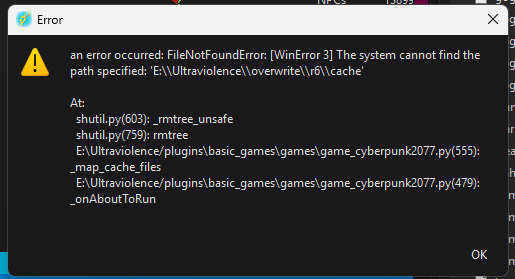

[ <a href="https://github.com/Gallahorn/Ultraviolence/blob/main/README.md">Getting Started</a> ]
[ <a href="https://github.com/Gallahorn/Ultraviolence/blob/main/Installation.md">Installation</a> ]
[ <a href="https://github.com/Gallahorn/Ultraviolence/blob/main/PostInstall.md">After Install</a> ]
[ <a href="https://github.com/Gallahorn/Ultraviolence/blob/main/ModSetup.md">Mod Setup</a> ]
[ <a href="https://github.com/Gallahorn/Ultraviolence/blob/main/AdvancedFeatures.md">Advanced Features</a> ]
[ <a href="https://github.com/Gallahorn/Ultraviolence/blob/main/Gameplay.md">Gameplay</a> ]
[ Common Issues ]

# Common Issues
This page documents common issues encountered during installation and gameplay.  
If you are looking for a specific issue, please use the search function and the table of contents.

# Contents
- [Common Issues](#common-issues)
- [Contents](#contents)
- [Installation](#installation)
  - [I'm stuck at the main menu screen](#im-stuck-at-the-main-menu-screen)
  - [Cannot open instance 'Portable'](#cannot-open-instance-portable)
  - [FileNotFoundError \[WinError3\]](#filenotfounderror-winerror3)
- [Gameplay](#gameplay)
  - [My difficulty seems to be incorrect](#my-difficulty-seems-to-be-incorrect)

# Installation
This section lists problems that can occur during the installation of the modlist.

## I'm stuck at the main menu screen
... but the main menu isn't showing.

This occurs because you skipped a step in the [Installation](Installation.md) section of the readme.  
You **__NEED__** to start the vanilla game first before starting the modlist in MO2.  

Please refer to the linked section above and make sure you follow **__ALL THE STEPS__**.

## Cannot open instance 'Portable'
If you get an error like this:  

Make sure not to use any special characters in your folder name except for dashes (-).  
Wabbajack can't handle characters like [ ] in folder names.

## FileNotFoundError [WinError3] 
If you get an error like this:  

Your Wabbajack install didn't finish correctly (even if it reported no problems).  
Run Wabbajack again and point it to the same folders you did last time.

# Gameplay
This section lists problem that can occur during the gameplay in Ultraviolence.

## My difficulty seems to be incorrect
The modlist is engineered for VERY HARD difficulty only.  
So you must remain at VERY HARD at all times.

> [!WARNING]
> If you lower your difficulty, your game might become even harder, because the mods are not tuned to those difficulties.