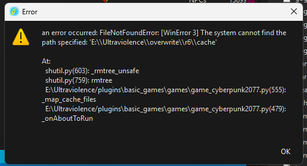

[ <a href="https://github.com/Gallahorn/Ultraviolence/blob/main/README.md">Getting Started</a> ]
[ <a href="https://github.com/Gallahorn/Ultraviolence/blob/main/Installation.md">Installation</a> ]
[ <a href="https://github.com/Gallahorn/Ultraviolence/blob/main/PostInstall.md">After Install</a> ]
[ <a href="https://github.com/Gallahorn/Ultraviolence/blob/main/ModSetup.md">Mod Setup</a> ]
[ <a href="https://github.com/Gallahorn/Ultraviolence/blob/main/AdvancedFeatures.md">Advanced Features</a> ]
[ <a href="https://github.com/Gallahorn/Ultraviolence/blob/main/Gameplay.md">Gameplay</a> ]
[ Common Issues ]

# Common Issues
This page documents common issues encountered during installation and gameplay.  
If you are looking for a specific issue, please use the search function and the table of contents.

# Contents
- [Common Issues](#common-issues)
- [Contents](#contents)
- [Installation](#installation)
  - [I'm stuck at the main menu screen](#im-stuck-at-the-main-menu-screen)
  - [Cannot open instance 'Portable'](#cannot-open-instance-portable)
  - [FileNotFoundError \[WinError3\]](#filenotfounderror-winerror3)
  - [Rebind CET Overlay hotkey](#rebind-cet-overlay-hotkey)
  - [Blackscreen Crash](#game-starts-with-black-screen-then-crash)
  - [Stuck on deploying](#game-stuck-on-deploying-mods)
  - [Game starts with out Main Menu](#game-starts-with-out-main-menu)
- [Gameplay](#gameplay)
  - [I can't drive my car, it's not moving](#i-cant-drive-my-car-its-not-moving)
  - [Where is my HUD? Where is 3rd person in driving? How does XY work?](#where-is-my-hud-where-is-3rd-person-in-driving-how-does-xy-work)
  - [I have weird visual effects on my screen](#i-have-weird-visual-effects-on-my-screen)
  - [My difficulty seems to be incorrect](#my-difficulty-seems-to-be-incorrect)
  - [Game crashes during loading / saving in flashback scenes](#game-crashes-during-loading--saving-in-flashback-scenes)
  - [Game crashes when entering cars (especially with NPCs)](#game-crashes-when-entering-cars-especially-with-npcs)

# Installation
This section lists problems that can occur during the installation of the modlist.

## I'm stuck at the main menu screen
... but the main menu isn't showing.

This occurs because you skipped a step in the [Installation](Installation.md) section of the readme.  
You **__NEED__** to start the vanilla game first before starting the modlist in MO2.  

Please refer to the linked section above and make sure you follow **__ALL THE STEPS__**.

## Cannot open instance 'Portable'
If you get an error like this:  

Make sure not to use any special characters in your folder name except for dashes (-).  
Wabbajack can't handle characters like [ ] in folder names.

## FileNotFoundError [WinError3] 
If you get an error like this:  

Your Wabbajack install didn't finish correctly (even if it reported no problems).  
Run Wabbajack again and point it to the same folders you did last time.

## Rebind CET Overlay hotkey
If you bound your CyberEngineTweaks hotkey to the wrong key, you can reset it.
- Find Ultraviolence settings mod in MO2
- Right click the mod and click "Show in Explorer"
- Find the file in the image and right-click open it  

- Find the line overlay_key in the file and set it to 0 and save it  

- Then start the game and you should get a CET popup on start-up.

## Game starts with black screen then crash.

### To diagnose:

- Turn off Threadscape and try to start the game,
If this doesn't work, continue with the following instructions,

- Disable all clothing mods (except the actual Cloth separator),

- Enable one separators worth at a time.

- If you enable a separator and start crashing, turn off half of the mods within that separator. If you crash, turn off half of the ones still enabled. Do this until you stop crashing.

- If you stop crashing, you know the mod was in the set you recently disabled and can then re-enable 1 by 1 until you start crashing again. The culprit is the last mod you enabled.

- If you don't stop crashing, keep following the same logic and eventually you'll work down towards 2 mods left and that'll mean you're left with 2 choices - pick one, disable it and see if you still crash. If you do, its the one still enabled, if you don't is the one you just disabled.

## Game stuck on deploying mods.

You are using the wrong launch option. You should use:

## Game starts with out main menu

If you started the game without getting a main menu you miss steps where you should launch vanilla cyberpunk before installing the list.

# Gameplay
This section lists problem that can occur during the gameplay in Ultraviolence.

## I can't drive my car, it's not moving
You didn't read the [Gameplay Page](Gameplay.md#driving) properly.

## Where is my HUD? Where is 3rd person in driving? How does XY work?
You have been sent here because you asked for support about or reported an **__intended feature__** as a bug.

The mechanic you are describing is not a bug, it is **__the modlist working as intended__**.  
So there is no setting to change, no mod to deactivate, no but to avoid.

Instead, have a careful read of our [Gampelay File](Gameplay.md).  
It will tell you exactly how the dozens of heavily gameplay alterings mods work.

> [!TIP]
> If you still have questions that were not clarified in the Gameplay document, please feel free to ask.  
> But be aware that you will be sent back to the readme if you ask questions which are answered there.  
> We know it's a long file and a lot to read, but it's a big modlist, and we can't read and understand it for you.  
> Help us help you here. Thanks.

## I have weird visual effects on my screen
There is a ton of mods that could cause this. This list integrates a variety of survival-style mods, you will need to balance many factors, such as cyberware-load, humanity, basic needs like hunger, thirst, etc.

Screen effects like flickering etc. commonly indicate a bad physical or mental state of your V.  
Please read our [Gampelay File](Gameplay.md) carefully, it will answer your questions or give you clues what you could look at to improve your situation.

## My difficulty seems to be incorrect
The modlist is engineered for VERY HARD difficulty only.  
So you must remain at VERY HARD at all times.

> [!WARNING]
> If you lower your difficulty, your game might become even harder, because the mods are not tuned to those difficulties.

## Game crashes during loading / saving in flashback scenes
If you have issues loading saves during "Johnny sections" of the game, there is a workaround for it.

- Make a backup of "Ultraviolence Loadorder"  

- Disable Hyst Angel body  

- Your save should load fine now
- After you done with the "Johnny section", you need to enable Angel body again (see screenshot above).
- After you enabled angel body, find the backup on the top of the left panel and righ click. 
- Select "Restore Backup", then click yes to overwrite.  

## Game crashes when entering cars (especially with NPCs)
If you have issues with game crashes when entering npc cars (like Rogue, Panam, Judy, Takamura's cars), disable "Hair Up 01" in MO2 or change your hairstyle at a ripper/mirror.

