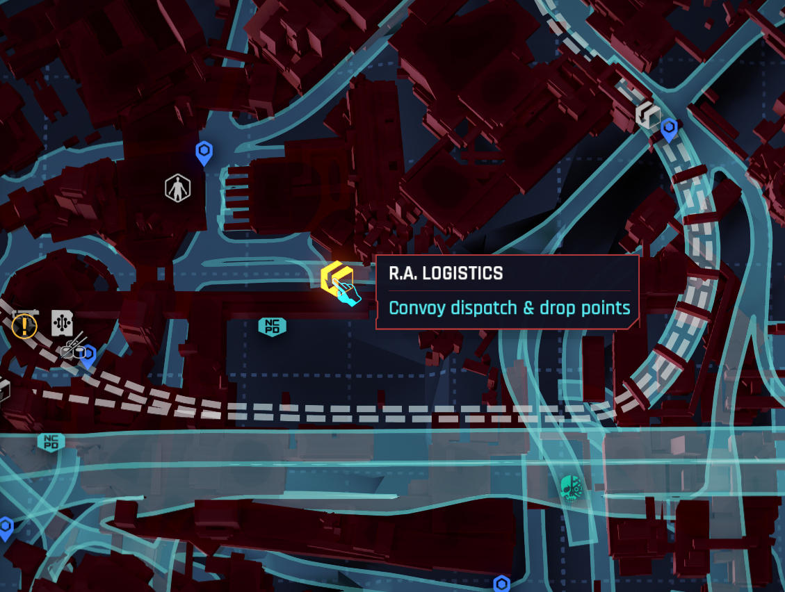
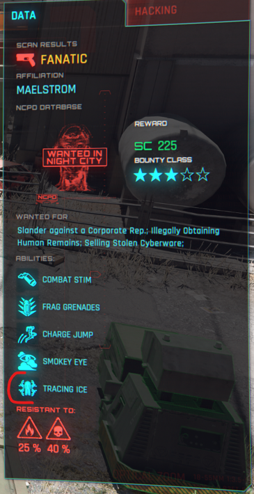

[ <a href="https://github.com/Gallahorn/Ultraviolence/blob/main/README.md">Getting Started</a> ]
[ <a href="https://github.com/Gallahorn/Ultraviolence/blob/main/Installation.md">Installation</a> ]
[ <a href="https://github.com/Gallahorn/Ultraviolence/blob/main/PostInstall.md">After Install</a> ]
[ <a href="https://github.com/Gallahorn/Ultraviolence/blob/main/ModSetup.md">Mod Setup</a> ]
[ <a href="https://github.com/Gallahorn/Ultraviolence/blob/main/AdvancedFeatures.md">Advanced Features</a> ]
[ Gameplay ]
[ <a href="https://github.com/Gallahorn/Ultraviolence/blob/main/CommonIssues.md">Common Issues</a> ]

# Gameplay
This section describes the mods used in Ultraviolence.  
It is very important to read through it, so you understand how the mechanics in this modlist work, as they are vastly different from vanilla Cyberpunk.

If you want to know more about a mod, just click on the section headings, they are linked to their respective mod pages.

# Contents
- [Gameplay](#gameplay)
- [Contents](#contents)
  - [The Interface (HUD)](#the-interface-hud)
  - [Driving](#driving)
  - [Permanent Vehicle Loss](#permanent-vehicle-loss)
  - [Claim or Sell Any Vehicles](#claim-or-sell-any-vehicles)
  - [Immersive Odometer and Fuel System](#immersive-odometer-and-fuel-system)
  - [Taxi Work in Night City](#taxi-work-in-night-city)
  - [Immersive Cyberware](#immersive-cyberware)
  - [Wannabe Edgerunner](#wannabe-edgerunner)
  - [Dark Future](#dark-future)
  - [Skillful and Skillful Attributes](#skillful-and-skillful-attributes)
  - [They Will Remember](#they-will-remember)
  - [Ammo Limiter](#ammo-limiter)
  - [Eviction Notice](#eviction-notice)
  - [Stealthrunner](#stealthrunner)
  - [Dedra's Truck Simulator](#dedras-truck-simulator)
  - [Dedra's JNC Joytoy 2.0](#dedras-jnc-joytoy-20)
  - [Drug Dealer](#drug-dealer)
  - [Radial Breach](#radial-breach)
  - [Trace Position Overhaul](#trace-position-overhaul)
  - [Night City Interactions](#night-city-interactions)
  - [Anti-Tracking Breach](#anti-tracking-breach)
  - [Watch Your Back](#watch-your-back)
  - [Filthy Access Points](#filthy-access-points)

    
## The Interface (HUD)
Here is an explanation of what all the new bars and icons do.  
Depending on your installed [Immersive Cyberware](#immersive-cyberware), you might not see every element of the HUD at any given time.  

## Driving
There are two main mods responsible for driving.  
These are [Enhanced Vehicle System](https://www.nexusmods.com/cyberpunk2077/mods/11765) and [Advanced Driving Controls](https://www.nexusmods.com/cyberpunk2077/mods/13426).

The default keybinds for ADC can be found in the [Advanced Features Section](AdvancedFeatures.md#612-advanced-driving-controls).  

The default keybinds for EVS are as follows:

## Permanent Vehicle Loss

> [!CAUTION]
> If your cars explode, get sent in to the water or other way is destoryed **you will NOT be able to get it back!**

## [Claim or Sell Any Vehicles](https://www.nexusmods.com/cyberpunk2077/mods/29620)

You can now own or sell stolen vehicles.  
When you have stolen a vehicle you can look on the map and you will see the following icons (if the car supports it):

  
Hackshops - These shops let you rewrite the access to the car and add them to your garage for a fee.

  
Paintshops - Here you can switch appearance of your vehicles.

  
Quick Drop off - Here you can drop of cars without people caring about ownership and silly things like that.

  
Chopshops - These buy almost every car. They pay depending on owner status, premium, corporate, gang affiliations.

  
Smugglers - These shops only buy owned/unlocked vehicles. These guys pay a premium for cars (around 10% more then Chopshops).  
They respect your ownership status/trim. Other factors that affect prices are premium cars, corporate- or gang affiliation.

## [Immersive Odometer and Fuel System](https://www.nexusmods.com/cyberpunk2077/mods/23834)

Cars in Night City don't run on air.  
You will have to refuel, repair and do check ups on your cars.  
On your map you will now see fuel stations where you can repair/refuel your cars.  Í
  

To set up up the 3D widget fuel meter you will need to do the following:

- Go into photomode and move the camera behind the car so you see the widget.
- Open CET
- Find the Odometer + Fuel

- Click 3D Setup and find these sliders.

- Move the widget inside your car and exit photomode.
- Open CET again and the place it where you want on inside the car with the sliders in the past image.

You can then save the preset if you need to use it in a similar car again.

## [Taxi Work in Night City](https://www.nexusmods.com/cyberpunk2077/mods/15624)

In Night City you can be a combat taxi driver.  
If you go to a data terminal, you now have the option to request a combat taxi or find one in the wild.  
Once you are in a taxi you can honk 2 times and get work.  
You then need to go pick up the client and drive it to the location they want.  
When you got the client in the car, they can request special things from you.  
Keep them alive, do tricks and other stuff.  
The better you are the more tips you get.

## [Immersive Cyberware](https://www.nexusmods.com/cyberpunk2077/mods/21916)
Immersive cyberware hides certain HUD elements behind certain cyberware.  
Optics now have up to 8 slots for lenses, which you have to buy (at ripper docs) and equip by hovering over your face slot and press tab (same key as for cyberdeck).  
  
The lens options are:
- Xray Lens - Required to see highlighted targets through the walls
- Vehicle VR - Required for 3rd person while driving a vehicle
- Threat Detector - Required to see enemy threat indication (indicator when player is stealthed)
- Radar - Required to see minimap and to use tag function.
- Health Scanner - Required to see enemy health bars
- Grenadier - Required to see grenade trajectory / explosion area and enemy grenades
- Scanning Focus - Required for time dilation while scanning
- Aim Assist - Required to see aiming reticle
- Cyberware Scanner - Required to see enemy abilities when scanning
- Hypno Lens - +8 to Cool attribute checks
- Cyberware Eye Casing - +50 armor, and grants blind immunity
- Holo Display: Ads - increases money rewards from quests, but displays ads at the top of your screen
  
Health and Ammo counter is hidden behind:
- Biomonitor - To see your HP
- Hand Cyberwares - To see ammo counter

> [!NOTE]
> The Immersive Cyberware implants are **NOT** in the default ripperdoc interface, they are **SOLD** by the ripperdocs, in their **TRADE MENU**.

## [Wannabe Edgerunner](https://www.nexusmods.com/cyberpunk2077/mods/5646)
The "Wannabe Edgerunner - A simple Cyberpsychosis mod" introduces significant gameplay changes to Cyberpunk 2077 by incorporating a cyberpsychosis mechanic that simulates the mental instability caused by overusing cybernetic implants. 
    
Here’s how it affects gameplay:

1. Humanity Cost for Cyberware
Each cyberware installation reduces V's "humanity" stat, representing their psychological stability.
Different cyberware types have varying humanity costs. Players must balance the power they gain from cyberware with the potential loss of humanity.
    
2. Cyberpsychosis State
If V's humanity drops below a certain threshold, they risk entering a state of cyberpsychosis.  
During cyberpsychosis:  
- Debuffs: V may suffer penalties like reduced accuracy, increased recoil, health regeneration loss, or erratic stamina behavior.  
- Behavioral Changes: V may exhibit uncontrollable or reckless actions.

3. Humanity Regeneration and Recovery
Humanity can recover over time or through specific in-game actions, such as removing cyberware or using recovery methods introduced by the mod.
Like sleeping, showering, playing pool, drinking with friends and more.

4. Enhanced Immersion
The mod introduces a risk-reward system, emphasizing the consequences of over-augmentation.  
It encourages more strategic gameplay, making players think twice before installing every available cyberware piece.  
By adding this mechanic, the mod significantly increases the depth and realism of the Cyberpunk 2077 experience, aligning the gameplay with the lore of the cyberpunk genre.

## [Dark Future](https://www.nexusmods.com/cyberpunk2077/mods/16300)
The "Dark Future - Urban Survival Gameplay" mod introduces several gameplay changes to Cyberpunk 2077, transforming it into a more immersive survival experience.  

Here’s how it alters the game:

1. Basic Needs Management  
Hunger, Thirst, and Energy:  
V now needs to eat, drink, and sleep to stay functional.  
Neglecting these needs results in penalties like:  
- Reduced stamina regeneration.
- Lower movement speed.
- Impaired reflexes and aim.
- Players must gather food, beverages, and find opportunities to rest to maintain these stats.

2. Anxiety and Mental Health
Stress Accumulation:  
Engaging in combat or stressful events increases V’s anxiety levels.  
High anxiety can lead to:
- Shaky aim.
- Decreased hacking efficiency.
- Slower reaction times.  
Stress Relief:
- Anxiety can be managed by relaxing in safe areas, sleeping, or using specific items such as medications or recreational substances.

3. Addiction System  
Using stimulants or certain consumables carries a risk of addiction.  
Addiction Effects:
- Negative impacts on performance, such as debuffs to stats or withdrawal symptoms if V doesn’t consume the addictive substance.  
Management:
- Players must carefully balance the use of substances or seek remedies to overcome addiction.

4. Sleep and Rest Mechanics  
Regular sleep is required to maintain energy and mental stability.  
Lack of sleep results in:
- Reduced stamina.
- Slower reflexes.
- Players are encouraged to use V’s apartment or find other safe locations for rest.

5. Immersive Role-Playing Elements  
Encourages careful resource management and strategic planning.  
Adds realism by tying V’s physical and mental state directly to gameplay performance.  
Creates a daily cycle where survival is intertwined with mission objectives.

6. Balancing and Realism
These mechanics force players to think beyond combat and hacking, incorporating survival elements into every aspect of gameplay.  
The changes make Night City feel more alive and demanding, emphasizing its harsh and unforgiving nature.  
    
Overall Impact: This mod shifts Cyberpunk 2077 from a purely action-oriented RPG to a survival-driven experience, requiring players to carefully manage V’s physical and mental health to thrive in the dystopian setting.

## [Skillful](https://www.nexusmods.com/cyberpunk2077/mods/9309) and [Skillful Attributes](https://www.nexusmods.com/cyberpunk2077/mods/9281)
Skillful and Skillful Attributes changes how the leveling works in cyberpunk.

Attributes aren't earned on level up anymore but now you get attributes by levelling up your skills.  
You get 1 level in the related attribute per 3 skill levels.  
You gain 1 extra perk point per 12 skill levels and 1 perk point per 10 street cred.  
You also gain 1 cyberware capacity per 6 levels for all skills excluding headhunter.  

Here is how the skills affect the attributes:
- Shinobi - Reflexes
    - Gets 1.8x multiplier on exp up to skill level 59, then you gain at a rate of 0.8
    - Shinobi also shares 15% of its exp to Solo
- Engineer - Technical Ability
    - Gets 1.9x multiplier up to lvl 59, then after that gains at 1x times
    - Engineer and Netrunner shares 15% exp
- Headhunter - Cool
    - Gets 0.8x multiplier all the time
- Netrunner - Intelligence
    - Gets 1.7x multiplier on exp up to skill level 59 and after that you gain 0.8x
    - Netrunner and Engineer shares 15% exp.
- Solo - Body
    - Gets 2.2x multiplier on exp up to skill level 59 and after that you gain 1x
    - Solo and Shinobi shares 15% exp

## [They Will Remember](https://www.nexusmods.com/cyberpunk2077/mods/19747)
At the core of this mod is Identification — NPCs will behave differently based on whether they recognize you, and this recognition is influenced by your past actions and kill count for each faction.
- Faction Kill Count: Each faction tracks how many times you’ve defeated their members. This count increases when you’re recognized, and it affects how likely they are to turn hostile toward you.
- Hostile Behavior: Once a faction becomes hostile, enemies who recognize you will attack on sight, without any warning (no yellow or red markers). This applies to gang members, NCPD, and Night City Alive NPCs.
- Hit-Squads: Hostile factions can send Hit-Squads after you in public areas, with the chance and strength of these squads depending on your Street Cred and kill count.
- Memory Decay: Every game day, old kills are forgotten, and there’s a chance the faction may return to neutral status. However, if the kill count is still high, this chance is low.
- Redemption: Some fixers may offer to negotiate with hostile factions to clear your record.
    
Disguise System
- Face Disguise: Helps reduce the chance of being recognized. The better your disguise, the less likely enemies will attack you or remember your kills.
- Affiliated Disguise: Allows you to pretend to be a member of a gang. This can let you pass as one of them, complete gigs, or even get NCPD support in street fights — but only if you avoid suspicious behavior.
- Disguise Scores: Two scores are tracked in the CET overlay:
    - Face Disguise: Reflects how well you hide your identity.
    - Affiliation Disguise: Reflects how convincingly you dress like a gang member.
- Clothing: Many base-game and modded outfits are tagged with faction names. Use Inventory Adjustment HUB to find and build convincing disguises.

How Identification Works
- NPCs periodically check your identity if they can see you. The chance of identification increases with your Street Cred and kill count.
- Gangers and CorpoRats are more likely to recognize you, especially if your name is mentioned or your mugshot is shared.
- Stealth kills don’t count toward your kill counter unless you’re recognized. If you’re identified, even your previous stealth kills will be attributed to you.
- If identified, you have a short window to kill the enemy before others are alerted.

When Kills Are Remembered
- Kills are only added to your counter after you’re recognized.
- Stealth kills don’t count unless you’re identified.
- Savage kills (firearm or melee) count double, non-lethal defeats have a 50% chance of counting, and non-human defeats have a 30% chance.

Avoiding Identification
- Stealth and disguise are your best tools. Stay hidden and avoid drawing attention.
- In a car (especially a stolen one) makes you harder to identify.
- Optical Camo or CrystalCoat in vehicles helps hide your identity.
- Cyberware like Behavioral Imprint gives you temporary anonymity.
-  Quickhacks like Memory Wipe or Reboot Optics can prevent enemies from identifying you.
    
Street Cred and Living Legend

- As your Street Cred increases:
    - You become easier to identify, but low-tier enemies may hesitate or even flee in fear.
    - At Level 30, you’re a known figure — enemies may avoid fighting you.
    - At Level 40, you're a living legend — even weaker enemies may surrender or run.

## [Ammo Limiter](https://www.nexusmods.com/cyberpunk2077/mods/21807)
Does exactly what it says on the tin: limits your ammo pool.  

You current max ammo is:
- Handgun Ammo - 240
- Heavy Ammo - 240
- Shotgun Ammo - 120
- Sniper Ammo - 60

If your ammo pool is full, it converts the ammo to crafting parts at a rate of 50% and auto sells the other 50%.

It also limits the amount of ammo you are looting from ammo boxes:
- Handgun Ammo - 40
- Heavy Ammo - 40
- Shotgun Ammo - 10
- Sniper Ammo - 10

## [Eviction Notice](https://www.nexusmods.com/cyberpunk2077/mods/23187)
Makes it so you have to pay rent for your apartments.  

- Rent in Act 1 of the main quest is not required, and you'll receive messages from landlords at the start of each 7-day rental period. You can pay via text. If you fail to pay on time, you'll incur daily late fees until the rent is paid. The initial deposit you paid for an apartment is a refundable security deposit, but it's kept if you're evicted.
- Rent cost, period, and late fees are fully customizable through Mod Settings.
- If you don’t pay by the next rental period, you’ll be evicted and can't re-enter the property until Bob from EZEstates helps you move back in.  
Bob Westgate is your main contact for moving in/out, checking rent due dates, and setting up AutoPay (for a fee of 2,000 Eurodollars per period).
- AutoPay consolidates payment reminders and reduces the number of messages from landlords, but it’s disabled if you can’t cover the payment. You must settle all outstanding rent with landlords before AutoPay can be re-enabled.
- Apartment names have been updated (e.g., Northside → Martin St. Motel, Glen → Glenview Lofts, etc.), and these changes appear on the World Map and fast travel terminals.
- A Loyalty Quest is available at Glenview Lofts after making a few rent payments. Completing it unlocks a monthly rent discount and the option to purchase the apartment.  
Union32 (Corpo Plaza) allows special requests via text to Sylvia Vaughn, such as name changes or flower deliveries.
- Rental status screens in each apartment display whether rent is Paid, Due, or Overdue, and update in real-time.

There is ton of settings you can customize in mod settings.

## [Stealthrunner](https://www.nexusmods.com/cyberpunk2077/mods/7616)
This mod enhances Cyberpunk 2077 by introducing stealth-focused objectives, rewards, and a new perk tree to encourage non-combat gameplay. It builds on the existing stealth mechanics rather than overhauling them, offering players additional goals and incentives for stealthy playstyles.

Stealth Objectives  
Each objective has specific rules and rewards:
- Ghost: Avoid detection by enemies (entering combat). Fails if forced by the game.
- Shadow: Avoid suspicion (enemy detection or finding bodies). Fails with poor incapacitation or excessive hacking traces.
- Pacifist: Avoid killing human enemies or civilians. Mechs, drones, and androids can be destroyed.
- No-Touch: Avoid attacking enemies. Quickhacks and pickpocketing are allowed.
- Hero: Save civilians without killing them and incapacitate enemies threatening them.

Rewards per objective:
- Ghost/Shadow: Money, Headhunter XP
- Pacifist: XP, Street Cred
- No-Touch: XP, Street Cred, Headhunter XP
- Hero: Money, random weapon recipe (rarity depends on crafting perks)
    
Rewards and Progression
- Perk Points: Earned at each objective level.
- Cyberware: Unlock new stealth-focused cyberware (e.g., Arasaka Lurker Camo, Biotechnica Parasitic Camo).
- Recipes: Unlock weapon blueprints like Wind (silent Ashura).

Progression Scaling 
- Reward thresholds reduce if you start the mod later in the game (based on your level at that time).

Perk Tree
- 11 New Perks: Focus on stealth abilities rather than stat boosts.
  - Pickpocket (3 levels): Loot enemies undetected with a 20% chance of extra loot.
  - Audio Disruption (2 levels): Reduce footstep sound radius by 50%.
  - Cyberninja (2 levels): Melee attacks don’t trigger combat (unless seen), and deal 25% more damage when cloaked.
  - Energy Shield (3 levels): Take 50% less damage on the first hit after entering combat.
  - Code Injection (3 levels): AOE takedown effect on nearby enemies.

Known Limitations
- Not All Quests Support All Objectives: Some quests (e.g., Cyberpsycho gigs) may only support a subset of objectives.

## [Dedra's Truck Simulator](https://www.nexusmods.com/cyberpunk2077/mods/24102)
Dedra’s Truck Simulator adds the ability to deliver cargo around night city.  
For more information, you can watch [this video](https://www.youtube.com/watch?v=n1ztSPG-VaQ&t=33s).

To start working you need to go to this point and follow the instructions:  

## [Dedra's JNC Joytoy 2.0](https://www.nexusmods.com/cyberpunk2077/mods/30145)

You can work as a joytoy in Night City now. To start working you will have to find one of these icons on the map:  
  
and go to the terminal there. You can pick your name and sign up for being able to hook up through the phone.

When you sign up for a shift you can keep requesting female/male clients util you feel like you are done. When you are done you can sign off. Don't forget to pay the tigerclaws their part, otherwise they might hunt you.

## [Drug Dealer](https://www.nexusmods.com/cyberpunk2077/mods/27800)

You can now sell and make drugs in Night City.  
You will see different icons on the map when DD is active:

  
These are rival gangs that you need to defeat to help control your turf.  
They also drop materials you need to make products.

Here you can make products out of the raw materials you have.  
There are stimulants/depressants labs so go to the right lab for what you need.

  
Here you can bulk sell products you have made.

  
This icon means your turf is contested so you need to defend it.

In your phone you also have a number you can call Yukmouth and get bigger deals, info on where to attack gangs, recipes and other stuff.

## [Radial Breach](https://www.nexusmods.com/cyberpunk2077/mods/21077)
Fixes and makes it so that if you hack a access point you will lower the cost for quickhacks.

## [Trace Position Overhaul](https://www.nexusmods.com/cyberpunk2077/mods/12445)
Only enemies with the appropriate ICE (Tracing Ice) or netrunners have capabilities can trace the player's quickhacks. Random enemies or unskilled NPCs are no longer able to trace the player, making stealth gameplay more strategic.  

## [Night City Interactions](https://www.nexusmods.com/cyberpunk2077/mods/5519)
NCI makes it so you are able to meet up with your partners and friends to drink, chat, help you relax your nerves and feel more human.

Locations:
- Watson: Partner drinks at Tom's Diner, Lizzies, and Afterlife; plus a few solo drink spots
- Westbrook: Partner drinks at Lele Park, Dark Matter, and Xiao Xiongma; plus a few solo drink spots
- Heywood: Partner drinks at Chubby Buffalo's, Dicky Twister, Pinche Polo, and El Coyote Cojo
- Pacifica and Badlands: Partner drinks at both Nomad Camps, the Sunset Motel; plus a few solo drink spots
- Santo Domingo: Partner drinks at Buryger, Red Dirt, Kenmore Diner, the Market, PieZ, and Capitan Caliente

## [Anti-Tracking Breach](https://www.nexusmods.com/cyberpunk2077/mods/27505)
This mod lets you interrupt and counterhack enemy netrunners.

When you are getting tracked, you will see a prompt on the screen.  
If you press the button (Default:F), you will have to do a time limited hack pop-up on your screen. If you beat the hack
in time you will disrupt the tracking or do a counterhack if you have the "Counter-A-Hack" perk.

## [Watch Your Back](https://www.nexusmods.com/cyberpunk2077/mods/27792)

Night City isn't a safe city, especially at night.  
There is a chance that people will try to rob you of your money, consumables, ammo, crafting components, junk, and mods/attachments.

To recover your stolen possesions you will need to hunt down the theif or members of the same gang.

## [Filthy Access Points](https://www.nexusmods.com/cyberpunk2077/mods/27698)

Hacking access points isn't safe in Night City. Your personal link will suffer attacks and degrade if you fail to hack or don't succeed well enough (minimum 3 daemon uploads).

Your link will recover up to 50% of lost integrity by itself. For the rest you will have to go to a ripperdoc and have them repair it for you. Letting the health of the link drop to low will be fatal.

You can see the health of your link in the cyberware tab.

