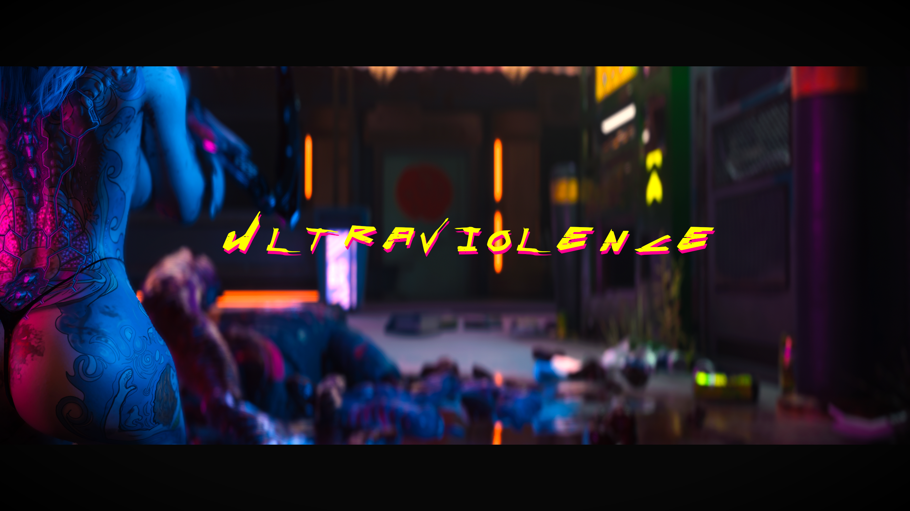

[ <a href="https://github.com/Gallahorn/Ultraviolence/blob/main/README.md">Getting Started</a> ]
[ <a href="https://github.com/Gallahorn/Ultraviolence/blob/main/Installation.md">Installation</a> ]
[ <a href="https://github.com/Gallahorn/Ultraviolence/blob/main/PostInstall.md">After Install</a> ]
[ <a href="https://github.com/Gallahorn/Ultraviolence/blob/main/ModSetup.md">Mod Setup</a> ]
[ <a href="https://github.com/Gallahorn/Ultraviolence/blob/main/AdvancedFeatures.md">Advanced Features</a> ]
[ Gameplay ] 

# Contents
- [Contents](#contents)
  - [1. Wannabe Edgerunner](#1-wannabe-edgerunner)
  - [2. Santa Muerte](#2-santa-muerte)
  - [3. Dark Future](#3-dark-future)
  - [4. Immersive Cyberware](#4-immersive-cyberware)
  - [5. Skillful and Skillful Attributes](#5-skillful-and-skillful-attributes)
  - [6. They Will Remember](#6-they-will-remember)
  - [7. hardcore22/netrunning](#7-hardcore22netrunning)
  - [8. Ammo Limiter](#8-ammo-limiter)
  - [9. Synthdose](#9-synthdose)
  - [10. Eviction Notice](#10-eviction-notice)
  - [11. Apartment Outfits](#11-apartment-outfits)
    
## 1. Wannabe Edgerunner

The "Wannabe Edgerunner - A simple Cyberpsychosis mod" introduces significant gameplay changes to Cyberpunk 2077 by incorporating a cyberpsychosis mechanic that simulates the mental instability caused by overusing cybernetic implants. 
    
Here’s how it affects gameplay:

1. Humanity Cost for Cyberware
Each cyberware installation reduces V's "humanity" stat, representing their psychological stability.
Different cyberware types have varying humanity costs. Players must balance the power they gain from cyberware with the potential loss of humanity.
    
2. Cyberpsychosis State
If V's humanity drops below a certain threshold, they risk entering a state of cyberpsychosis.  
During cyberpsychosis:  
- Debuffs: V may suffer penalties like reduced accuracy, increased recoil, health regeneration loss, or erratic stamina behavior.  
- Behavioral Changes: V may exhibit uncontrollable or reckless actions.

3. Humanity Regeneration and Recovery
Humanity can recover over time or through specific in-game actions, such as removing cyberware or using recovery methods introduced by the mod.

4. Customizability
The mod includes options to tailor the experience, such as adjusting:  
- The humanity cost of individual cyberware.
- The threshold for triggering cyberpsychosis.
- The intensity and duration of debuffs.
- This allows players to align the mod’s mechanics with their preferred level of challenge.

5. Enhanced Immersion
The mod introduces a risk-reward system, emphasizing the consequences of over-augmentation.  
It encourages more strategic gameplay, making players think twice before installing every available cyberware piece.  
By adding this mechanic, the mod significantly increases the depth and realism of the Cyberpunk 2077 experience, aligning the gameplay with the lore of the cyberpunk genre.

## 2. Santa Muerte

The "Santa Muerte - Death Alternative" mod for Cyberpunk 2077 transforms the gameplay experience by introducing alternative outcomes to V's death, moving away from the standard game over screen.  
Here's how it changes gameplay:

1. Dynamic Death Scenarios
Instead of restarting at the last checkpoint when V dies, the mod initiates alternative scenarios:  
- Rescue Events: Friendly NPCs or factions may intervene to save V, adding a narrative twist.
- Revival Scenes: V may wake up in a medical facility, hideout, or other location, reflecting the game's immersive world.
- Capture or Loss: In some cases, V may be captured as a consequence of dying.

2. Consequences for Failure
Death is no longer the end but comes with penalties:  
Setbacks in quests or progress, depending on the context of the death.

3. Immersive Continuity
The mod blends V's failures into the world of Night City, maintaining immersion by treating death as part of the narrative.  
For example:  
- V might wake up in a ripperdoc's clinic after being "saved."
- Gangs or enemies might exploit V's vulnerability.

## 3. Dark Future

The "Dark Future - Urban Survival Gameplay" mod introduces several gameplay changes to Cyberpunk 2077, transforming it into a more immersive survival experience.  

Here’s how it alters the game:

1. Basic Needs Management  
Hunger, Thirst, and Energy:  
V now needs to eat, drink, and sleep to stay functional.  
Neglecting these needs results in penalties like:  
- Reduced stamina regeneration.
- Lower movement speed.
- Impaired reflexes and aim.
- Players must gather food, beverages, and find opportunities to rest to maintain these stats.

2. Anxiety and Mental Health
Stress Accumulation:  
Engaging in combat or stressful events increases V’s anxiety levels.  
High anxiety can lead to:
- Shaky aim.
- Decreased hacking efficiency.
- Slower reaction times.  
Stress Relief:
- Anxiety can be managed by relaxing in safe areas, sleeping, or using specific items such as medications or recreational substances.

3. Addiction System  
Using stimulants or certain consumables carries a risk of addiction.  
Addiction Effects:
- Negative impacts on performance, such as debuffs to stats or withdrawal symptoms if V doesn’t consume the addictive substance.  
Management:
- Players must carefully balance the use of substances or seek remedies to overcome addiction.

4. Sleep and Rest Mechanics  
Regular sleep is required to maintain energy and mental stability.  
Lack of sleep results in:
- Reduced stamina.
- Slower reflexes.
- Players are encouraged to use V’s apartment or find other safe locations for rest.

5. Immersive Role-Playing Elements  
Encourages careful resource management and strategic planning.  
Adds realism by tying V’s physical and mental state directly to gameplay performance.  
Creates a daily cycle where survival is intertwined with mission objectives.

6. Balancing and Realism
These mechanics force players to think beyond combat and hacking, incorporating survival elements into every aspect of gameplay.  
The changes make Night City feel more alive and demanding, emphasizing its harsh and unforgiving nature.  
    
Overall Impact: This mod shifts Cyberpunk 2077 from a purely action-oriented RPG to a survival-driven experience, requiring players to carefully manage V’s physical and mental health to thrive in the dystopian setting.

## 4. Immersive Cyberware
Immersive cyberware hides certain HUD elements behind certain cyberware.  
Optics now have up to 8 slots for lenses, which you have to buy and equip by hovering over your face slot and press tab (same key as for cyberdeck).  
  
The lens options are:
- Xray Lens - Required to see highlighted targets through the walls
- Vehicle VR - Required for 3rd person while driving a vehicle
- Threat Detector - Required to see enemy threat indication (indicator when player is stealthed)
- Radar - Required to see minimap
- Health Scanner - Required to see enemy health bars
- Grenadier - Required to see grenade trajectory / explosion area and enemy grenades
- Scanning Focus - Required for time dilation while scanning
- Aim Assist - Required to see aiming reticle
- Cyberware Scanner - Required to see enemy abilities when scanning
- Hypno Lens - +8 to Cool attribute checks
- Cyberware Eye Casing - +50 armor, and grants blind immunity
- Holo Display: Ads - increases money rewards from quests, but displays ads at the top of your screen
  
Health and Ammo counter is hidden behind:
- Biomonitor - To see your HP
- Hand Cyberwares - To see ammo counter

## 5. Skillful and Skillful Attributes
Skillful and Skillful Attributes changes how the leveling works in cyberpunk.

Attributes aren't earned on level up anymore but now you get attributes by levelling up your skills.  
You get 1 attribute point per 3 skill levels.  
You gain 1 extra perk point per 12 skill levels and 1 perk point per 10 street cred.  
You also gain 1 cyberware capacity per 6 levels for all skills excluding headhunter.  

Here is how the skills affect the attributes:
- Shinobi - Reflexes
    - Gets 1.8x multiplier on exp up to skill level 59, then you gain at a rate of 0.8
    - Shinobi also shares 15% of its exp to Solo
- Engineer - Technical Ability
    - Gets 1.9x multiplier up to lvl 59, then after that gains at 1x times
    - Engineer and Netrunner shares 15% exp
- Headhunter - Cool
    - Gets 0.8x multiplier all the time
- Netrunner - Intelligence
    - Gets 1.7x multiplier on exp up to skill level 59 and after that you gain 0.8x
    - Netrunner and Engineer shares 15% exp.
- Solo - Body
    - Gets 2.2x multiplier on exp up to skill level 59 and after that you gain 1x
    - Solo and Shinobi shares 15% exp

## 6. They Will Remember
At the core of this mod is Identification — NPCs will behave differently based on whether they recognize you, and this recognition is influenced by your past actions and kill count for each faction.
- Faction Kill Count: Each faction tracks how many times you’ve defeated their members. This count increases when you’re recognized, and it affects how likely they are to turn hostile toward you.
- Hostile Behavior: Once a faction becomes hostile, enemies who recognize you will attack on sight, without any warning (no yellow or red markers). This applies to gang members, NCPD, and Night City Alive NPCs.
- Hit-Squads: Hostile factions can send Hit-Squads after you in public areas, with the chance and strength of these squads depending on your Street Cred and kill count.
- Memory Decay: Every game day, old kills are forgotten, and there’s a chance the faction may return to neutral status. However, if the kill count is still high, this chance is low.
- Redemption: Some fixers may offer to negotiate with hostile factions to clear your record.
    
Disguise System
- Face Disguise: Helps reduce the chance of being recognized. The better your disguise, the less likely enemies will attack you or remember your kills.
- Affiliated Disguise: Allows you to pretend to be a member of a gang. This can let you pass as one of them, complete gigs, or even get NCPD support in street fights — but only if you avoid suspicious behavior.
- Disguise Scores: Two scores are tracked in the CET overlay:
    - Face Disguise: Reflects how well you hide your identity.
    - Affiliation Disguise: Reflects how convincingly you dress like a gang member.
- Clothing: Many base-game and modded outfits are tagged with faction names. Use Inventory Adjustment HUB to find and build convincing disguises.

How Identification Works
- NPCs periodically check your identity if they can see you. The chance of identification increases with your Street Cred and kill count.
- Gangers and CorpoRats are more likely to recognize you, especially if your name is mentioned or your mugshot is shared.
- Stealth kills don’t count toward your kill counter unless you’re recognized. If you’re identified, even your previous stealth kills will be attributed to you.
- If identified, you have a short window to kill the enemy before others are alerted.

When Kills Are Remembered
- Kills are only added to your counter after you’re recognized.
- Stealth kills don’t count unless you’re identified.
- Savage kills (firearm or melee) count double, non-lethal defeats have a 50% chance of counting, and non-human defeats have a 30% chance.

Avoiding Identification
- Stealth and disguise are your best tools. Stay hidden and avoid drawing attention.
- In a car (especially a stolen one) makes you harder to identify.
- Optical Camo or CrystalCoat in vehicles helps hide your identity.
- Cyberware like Behavioral Imprint gives you temporary anonymity.
-  Quickhacks like Memory Wipe or Reboot Optics can prevent enemies from identifying you.
    
Street Cred and Living Legend

- As your Street Cred increases:
    - You become easier to identify, but low-tier enemies may hesitate or even flee in fear.
    - At Level 30, you’re a known figure — enemies may avoid fighting you.
    - At Level 40, you're a living legend — even weaker enemies may surrender or run.

## 7. hardcore22/netrunning

## 8. Ammo Limiter

## 9. Synthdose

## 10. Eviction Notice
Makes it so you have to pay rent for your apartments.  

- Rent in Act 1 of the main quest is not required, and you'll receive messages from landlords at the start of each 7-day rental period. You can pay via text. If you fail to pay on time, you'll incur daily late fees until the rent is paid. The initial deposit you paid for an apartment is a refundable security deposit, but it's kept if you're evicted.
- Rent cost, period, and late fees are fully customizable through Mod Settings.
- If you don’t pay by the next rental period, you’ll be evicted and can't re-enter the property until Bob from EZEstates helps you move back in.  
Bob Westgate is your main contact for moving in/out, checking rent due dates, and setting up AutoPay (for a fee of 2,000 Eurodollars per period).
- AutoPay consolidates payment reminders and reduces the number of messages from landlords, but it’s disabled if you can’t cover the payment. You must settle all outstanding rent with landlords before AutoPay can be re-enabled.
- Apartment names have been updated (e.g., Northside → Martin St. Motel, Glen → Glenview Lofts, etc.), and these changes appear on the World Map and fast travel terminals.
- A Loyalty Quest is available at Glenview Lofts after making a few rent payments. Completing it unlocks a monthly rent discount and the option to purchase the apartment.  
Union32 (Corpo Plaza) allows special requests via text to Sylvia Vaughn, such as name changes or flower deliveries.
- Rental status screens in each apartment display whether rent is Paid, Due, or Overdue, and update in real-time.

There is ton of settings you can customize in mod settings.

## 11. Apartment Outfits
With this mod you can name different wardrobe presets (to the following names) and they will get auto-equipped when you enter the area.
- DEFAULT - for your outdoor clothes
- APARTMENT - for what you want to wear when you come home
- SLEEP - for what you want to sleep in
- SHOWER - for what you wear after shower (might affect what you wear in other scenes where you're naked.  You can turn it on and off in the mod settings)