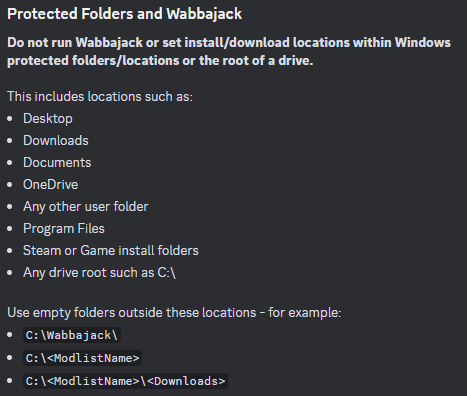
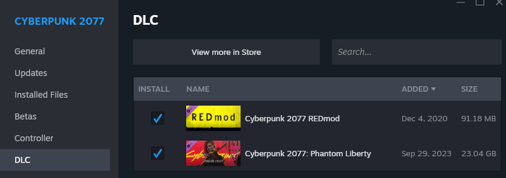
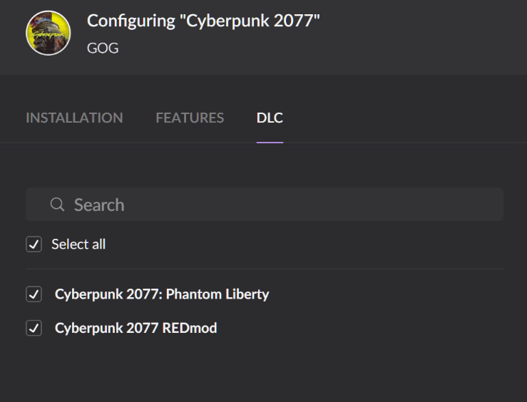
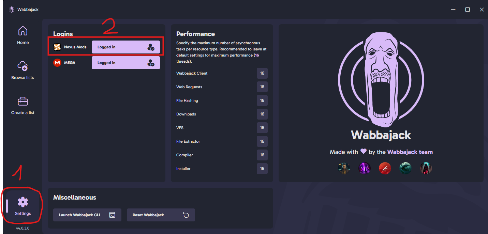
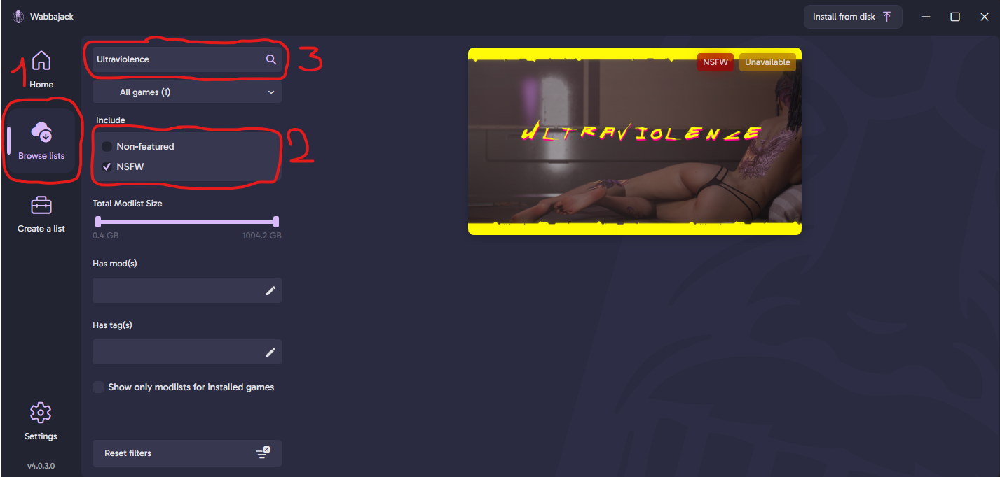
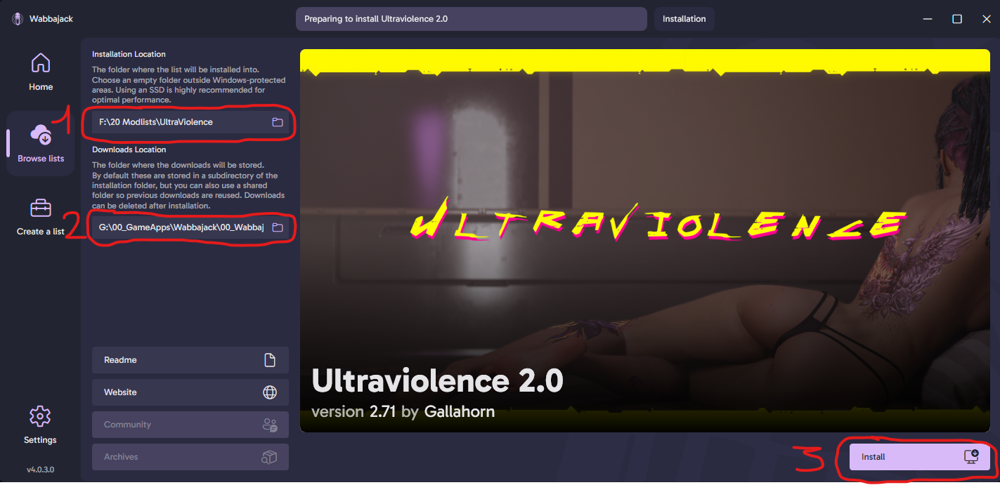
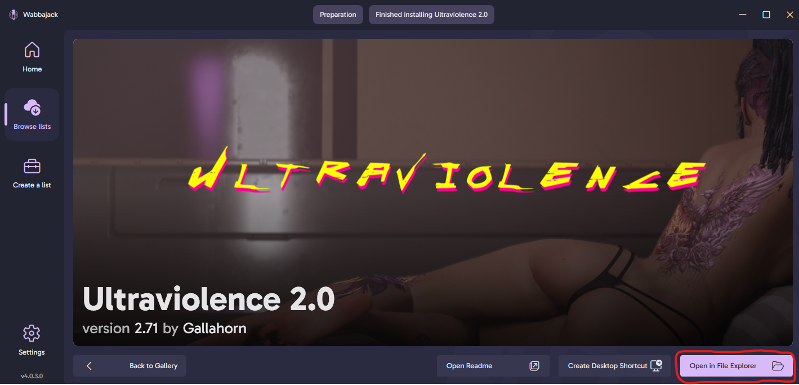

[ <a href="https://github.com/Gallahorn/Ultraviolence/blob/main/README.md">Getting Started</a> ]
[ Installation ]
[ <a href="https://github.com/Gallahorn/Ultraviolence/blob/main/PostInstall.md">After Install</a> ]
[ <a href="https://github.com/Gallahorn/Ultraviolence/blob/main/ModSetup.md">Mod Setup</a> ]
[ <a href="https://github.com/Gallahorn/Ultraviolence/blob/main/AdvancedFeatures.md">Advanced Features</a> ]
[ <a href="https://github.com/Gallahorn/Ultraviolence/blob/main/Gameplay.md">Gameplay</a> ]
[ <a href="https://github.com/Gallahorn/Ultraviolence/blob/main/CommonIssues.md">Common Issues</a> ]

# Installation
This section will guide you through the installation of the base game and the modlist.

# Contents
- [Installation](#installation)
- [Contents](#contents)
- [2 Install instructions](#2-install-instructions)
  - [2.1 Make a clean cyberpunk installation](#21-make-a-clean-cyberpunk-installation)
    - [2.1.1 Verify DLC and Enable Mods (Steam)](#211-verify-dlc-and-enable-mods-steam)
    - [2.1.2 Verify DLC and Enable Mods (GOG)](#212-verify-dlc-and-enable-mods-gog)
  - [2.2 After base game installation](#22-after-base-game-installation)
  - [2.3 Download Wabbajack](#23-download-wabbajack)
  - [2.4 Wabbajack settings](#24-wabbajack-settings)
  - [2.5 Install UltraViolence](#25-install-ultraviolence)
- [Continue](#continue)

# 2 Install instructions
> [!TIP]
> We provide installation instructions for the Steam and GoG version here.  
> 
> As far as we know, the EPIC store version of Cyberpunk should work as well.  
> Since nobody of the dev team owns the game on EPIC, you're going to have to figure out how to install with EPIC by yourself :)

## 2.1 Make a clean cyberpunk installation
> [!WARNING]
> Make sure ***NOT to install*** the base game or modlist ***in a protected folder***!  
> 

> [!CAUTION] 
> It is imperative that you follow [these instructions](https://support.cdprojektred.com/en/cyberpunk/pc/sp-technical/issue/2233/how-do-i-perform-a-clean-install-of-the-game) to make sure you have a clean fresh install of Cyberpunk.  
>
> **__DO NOT SKIP THIS STEP!__**

### 2.1.1 Verify DLC and Enable Mods (Steam)
- Make sure you have **__all DLC installed__**, as pictured below.  
**__YOU NEED Phantom Liberty and REDmod to install this modlist.__**

> [!TIP]
> If you don't have it yet, you can grab [Redmod here](https://store.steampowered.com/app/2060310/Cyberpunk_2077_REDmod/).
- After you have finished verifying your game, launch it from steam and enable mods in the REDlauncher.

### 2.1.2 Verify DLC and Enable Mods (GOG)
- Make sure you have all DLC installed.
If you dont have REDmod go [to the store](https://www.gog.com/en/game/cyberpunk_2077_redmod) and "buy" it, it is free.  
**__YOU NEED Phantom Liberty and REDmod to install this modlist.__**  

- Then launch the game once and login to Redlauncher if prompted for it.

## 2.2 After base game installation
- Once the game has loaded, in the settings under gameplay, **__turn off analytics and crossplatform saves__**.
- You can now close the game.

## 2.3 Download Wabbajack 
- Grab the newest version of [Wabbajack](https://www.wabbajack.org/).

- Start Wabbajack.

## 2.4 Wabbajack settings
- In Wabbajack, click the settings button and log in to your nexus account.

## 2.5 Install UltraViolence
- Click the "Browse lists" button and select the "NSFW" option on the left side.
- In the top box, search for "ultraviolence" and once it shows up on the right side, click on it.

- Select your ***installation folder*** and ***downloads folder*** as you desire (outside of protected folders as mentioned above).

> [!WARNING]
> Make sure to select your installation folder to be ***ON THE SAME DRIVE*** as your Cyberpunk installation.

> [!TIP]
> We recommend, to keep your downloads folder ***outside*** of your installation folder.  
> Because this is just storage, it can be placed anywhere else, even on a slower hard drive if space is a concern. Having a separate download folder means your downloads won't be wiped when you reinstall or update the modlist, and makes updating faster when you don't have to redownload the required mods.  
>  
> Your final folder setup may look something like this:  
> -   D:\Cyperpunk2077\    (your base game path, in a non-protected folder)
> -   D:\Ultraviolence\    (actual modlist install, preferably on the same drive as your game)
> -   D:\ultraviolence-downloads\    (your separate downloads location, used for storage)
- Hit install and wait until the "Installation finished" screen appears.
- On this screen, select "Open in File Explorer".

# Continue
If you succeeded with your installation, continue with the [Post installation steps](PostInstall.md).
