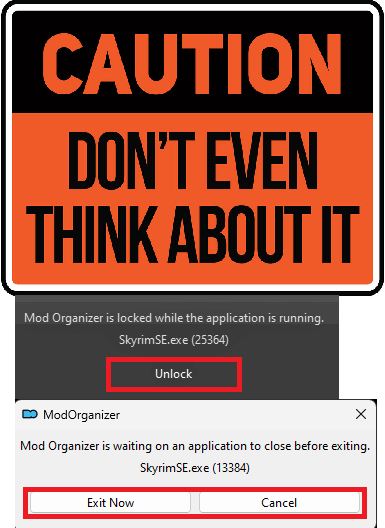
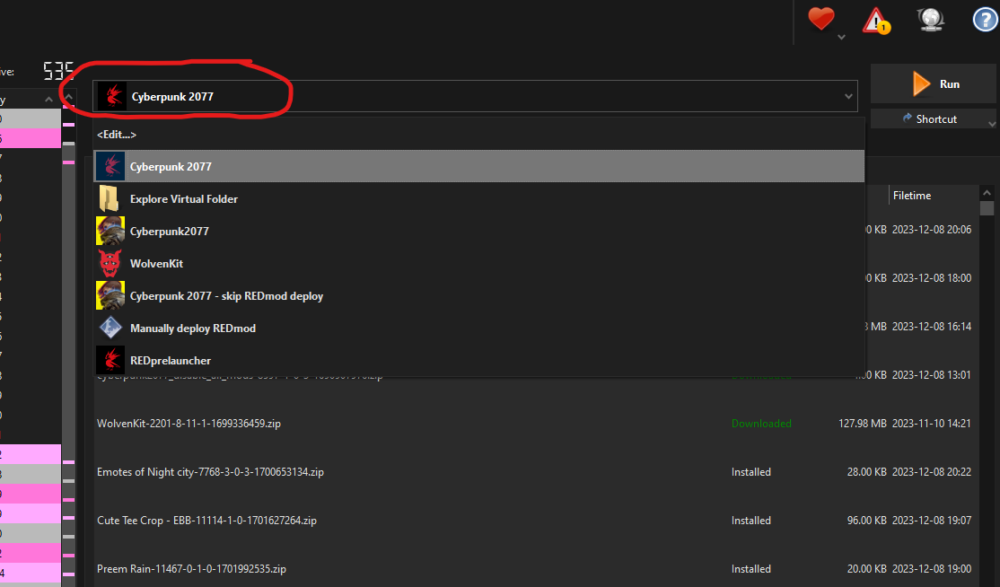
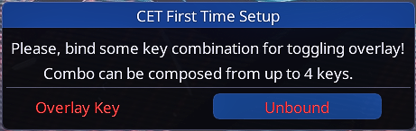
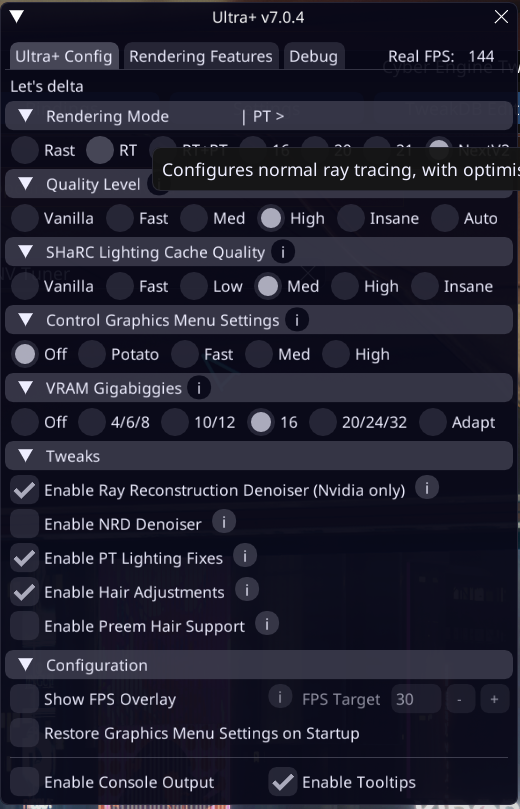
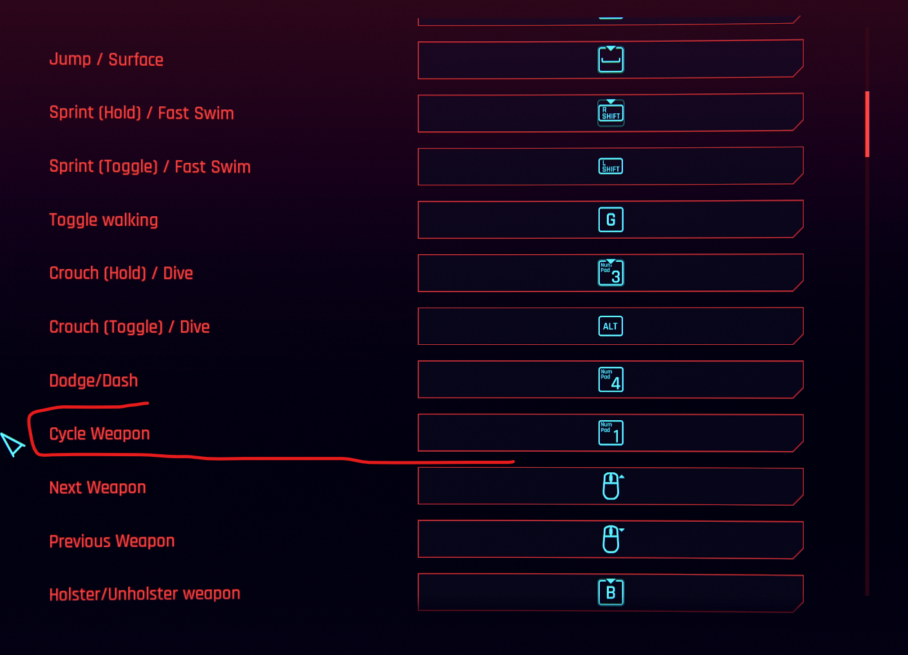

[ <a href="https://github.com/Gallahorn/Ultraviolence/blob/main/README.md">Getting Started</a> ]
[ <a href="https://github.com/Gallahorn/Ultraviolence/blob/main/Installation.md">Installation</a> ]
[ <a href="https://github.com/Gallahorn/Ultraviolence/blob/main/PostInstall.md">After Install</a> ]
[ Mod Setup ]
[ <a href="https://github.com/Gallahorn/Ultraviolence/blob/main/AdvancedFeatures.md">Advanced Features</a> ]
[ <a href="https://github.com/Gallahorn/Ultraviolence/blob/main/Gameplay.md">Gameplay</a> ] 

# Mod Setup
These steps will guide you through setting up all the ingame settings for UltraViolence.

# Contents
- [Mod Setup](#mod-setup)
- [Contents](#contents)
- [4 First game start](#4-first-game-start)
  - [4.1 Run the game](#41-run-the-game)
  - [4.2 CET Keybinds](#42-cet-keybinds)
- [5 Ingame settings](#5-ingame-settings)
- [6 Now you can start a new game!](#6-now-you-can-start-a-new-game)
  - [6.1 When you are ingame](#61-when-you-are-ingame)
  - [6.2 Ultra+](#62-ultra)
  - [6.3 Keybinds](#63-keybinds)
- [7 ALL DONE!](#7-all-done)

# 4 First game start

## 4.1 Run the game
- Run the launcher and ***don't ever touch the unlock button***!  

## 4.2 CET Keybinds
- When you start the game CET will popup and want you to pick a hotkey for its menu.  
CET is an important mod, so make the hotkey pretty easy to access. I have mine set next to the Enter key.

- When you arrive at the "Press space to continue" screen hit the CET to open the menu.  

# 5 Ingame settings
- Make sure you have Texture Quality set to High in the settings.  
> [!WARNING]
> You can only change this in the main menu before loading a game.  
> If you don't set the Textures to High, you will have weird textures on arms/body/faces.  

# 6 Now you can start a new game!
Head over to the main menu and start a new game :)

## 6.1 When you are ingame
- Open CET and pick a LUT you like with LUT SWITCHER  

- Visit H10 apartment after new install or update and watch the TV in the apartment.
- Dont EVER equip modded clothes in vanilla slots. Use wardrobe function for everything modded.

## 6.2 Ultra+
Ultraplus is a graphical enhancement/configuration tool that provides rendering options beyond what is available in the vanilla Cyberpunk 2077 settings menu. It will not magically make your game faster. It may cause crashes. The results are subjective, situational, and you must tailor the settings to what works for your machine. That said, from our limited testing, it seems pretty stable and performant. Ultraplus is mostly targeted towards ray and path tracing options, but also includes optimizations for rasterization only configurations as well.

The best option is to start be reading the mod page, which has extensive explanation and help for how to configure it. Read the stickied posts for support, and FAQ. For those running ray-tracing, also read the associated article on choosing and configuring path tracing options.

- [Ultra Plus Mod Page](https://www.nexusmods.com/cyberpunk2077/mods/10490)
- [Path Tracing Choices Article](https://www.nexusmods.com/cyberpunk2077/articles/1027)

Please note that Ultraplus will not necessarily enhance performance, but it does allow you to fine tune towards your performance limit, and has a frame rate target option that the mod uses to dynamically tweak settings when it has more or less overhead available. Start with a configuration that matches your current settings, and work from there.

To configure Ultraplus, open CET using the `Enter` key, and look for the Ultraplus configuration panel. Select options according to your current configuration, target preferences, and GPU RAM. For most changes, you must exit CET, open the game graphics settings, and simply hit `Apply` to finalize the Ultraplus changes.  

## 6.3 Keybinds
> [!WARNING] 
> You need to take a look at [Advanced Features](AdvancedFeatures.md) before you play.  
  Most important is to look over the keybind section.

- Make sure you unbind or rebind "Cycle Weapon" under Key Bindings, it will interfere with the vehicle controls.  

# 7 ALL DONE!
> [!WARNING]
> If you're a new player to the modlist, or you just updated, we **__highly recommend__** that you take a look at our [Advanced Features](AdvancedFeatures.md) (especially the Keybind section) and [Gameplay](Gameplay.md) pages, as these pages will show you many of the added features and tell you how the vastly altered gameplay in this modlist works.

You're done.  
Congratulations.  

Have a great adventure in Cyberpunk and enjoy your stay with UltraViolence!
