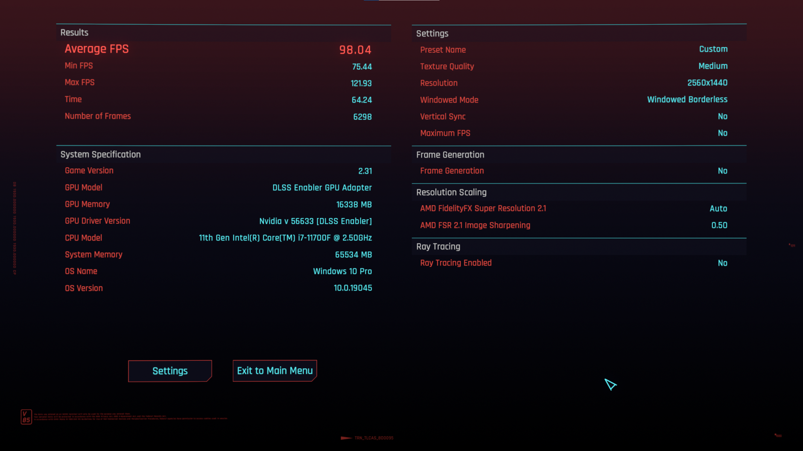
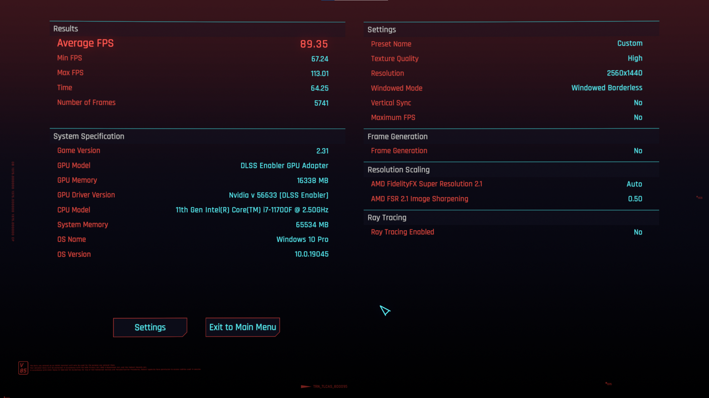
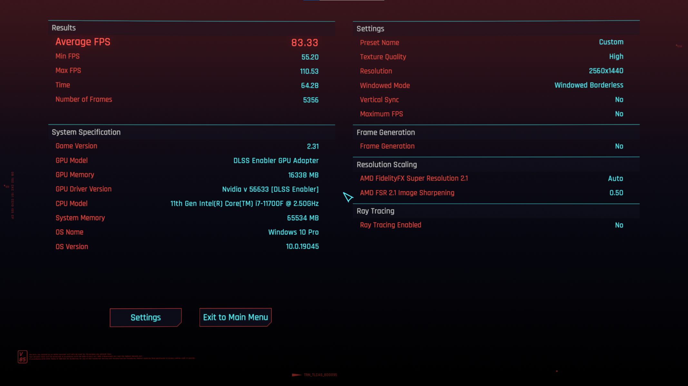
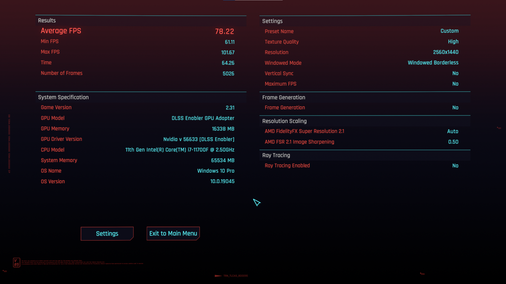
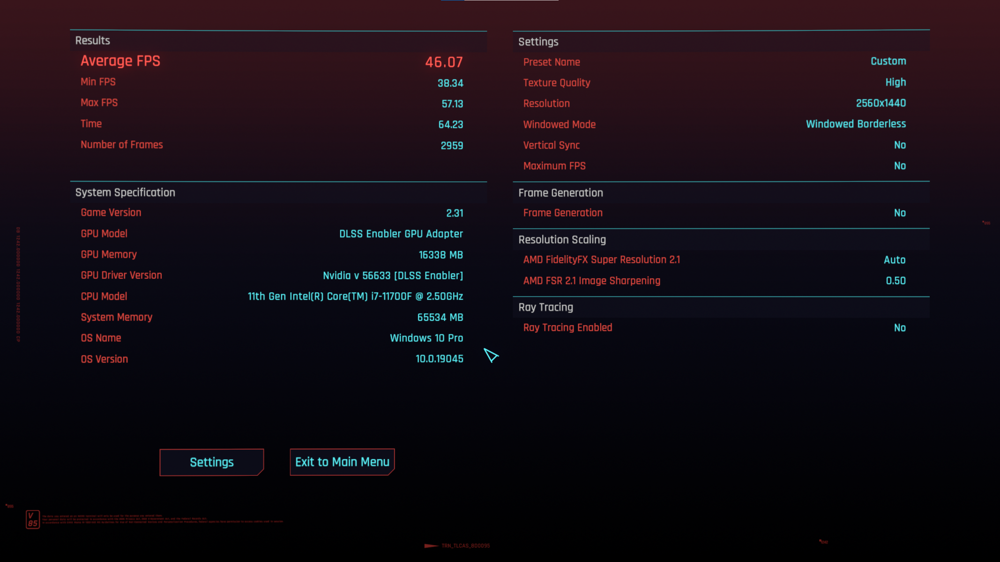
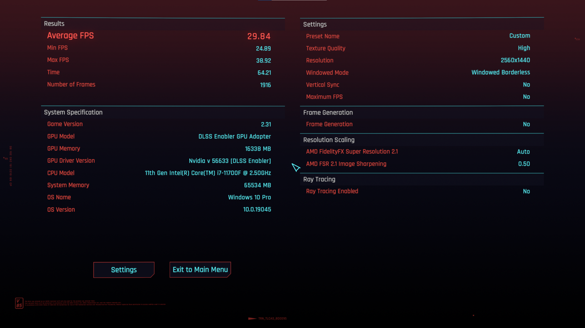
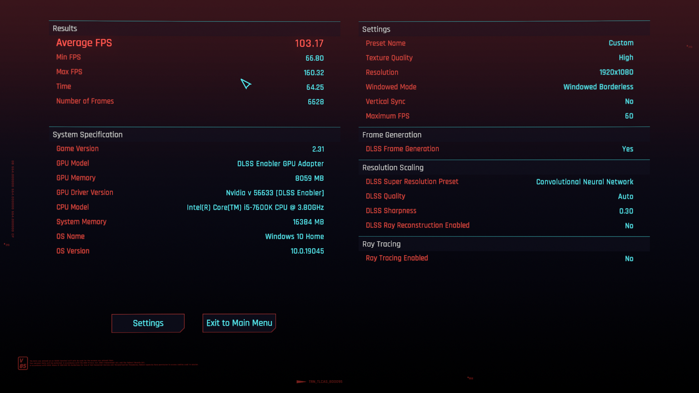
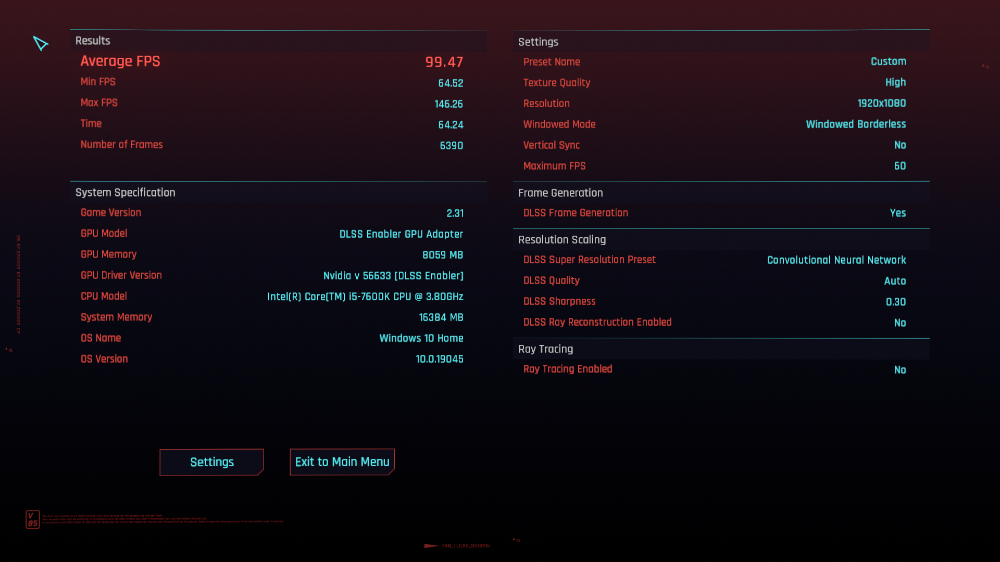
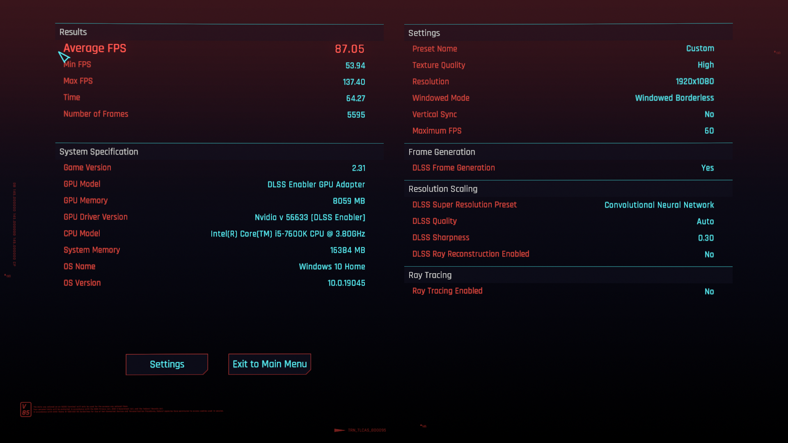
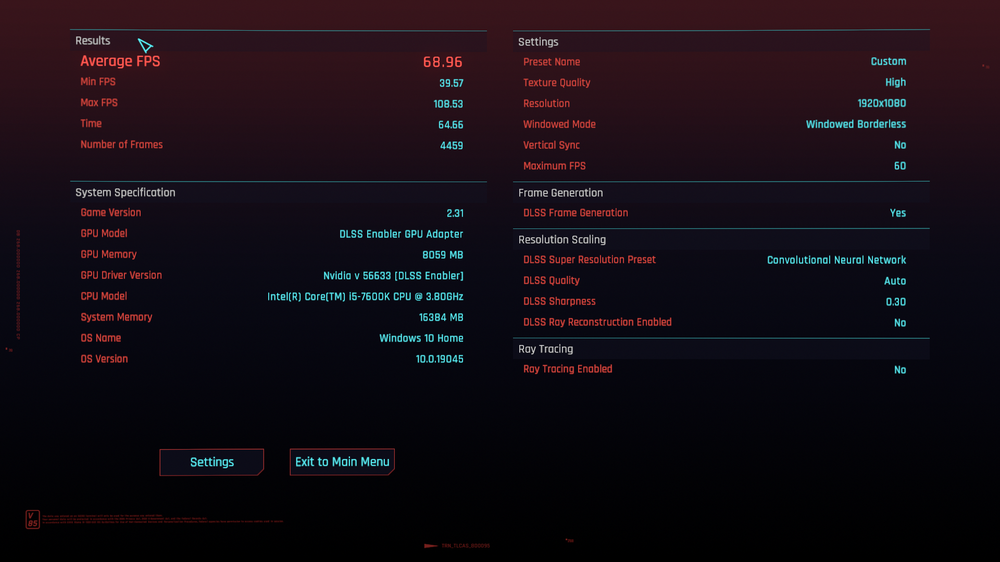

# Performance
In this file you will find some benchmark numbers of a variety of systems, so you are able to gauge on how good the modlist will run for you.  
Hardware details for each system will be provided in each section.  

As the landscape of current hardware is ever shifting, we will refrain from labelling system as low- or high-end etc.

> [!TIP]
> The presets will say "custom" on these benchmarks because the "Textures" slider has to remain on "high" for certain mods to work properly, even when in lower presets.

# Contents
- [Performance](#performance)
- [Contents](#contents)
  - [System 1 (i7-11700F, RX 6800, 32GB, 1440p)](#system-1-i7-11700f-rx-6800-32gb-1440p)
    - [System 1: No Raytracing](#system-1-no-raytracing)
    - [System 1: With Raytracing](#system-1-with-raytracing)
  - [System 2 (i5-7600k, GTX 1070 Ti, 32GB, 1080p)](#system-2-i5-7600k-gtx-1070-ti-32gb-1080p)
    - [System 2: No Raytracing](#system-2-no-raytracing)
  - [System 3 (i5-12600k, RTX 3070, 32GB, various)](#system-3-i5-12600k-rtx-3070-32gb-various)
    - [System 3: No Raytracing](#system-3-no-raytracing)
    - [System 3: With Raytracing](#system-3-with-raytracing)
        

## System 1 (i7-11700F, RX 6800, 32GB, 1440p)
System specs:
- CPU: 11th Gen Intel i7-11700F
- GPU: RX 6800 16GB
- RAM:  DDR4 2x32GB
- Resolution: 2560x1440

### System 1: No Raytracing
Low  

Medium  

High  

Ultra  

### System 1: With Raytracing
Low  

Medium  

High  

Overdrive  
No "overdrive" data was provided because the setting cause a crash for them.  

## System 2 (i5-7600k, GTX 1070 Ti, 32GB, 1080p) 
- CPU: i5-7600K
- RAM: 2x 8GB (3000mHz)
- GPU: GTX 1070Ti
- Resolution: 1920x1080

### System 2: No Raytracing
Low  

Medium  

High  

Ultra  

## System 3 (i5-12600k, RTX 3070, 32GB, various) 
This is the system of the modlist creator.

System specs:
- CPU: i5-12600k
- GPU: RTX 3070
- RAM: 32GB
- Resolution: 2560x1440

### System 3: No Raytracing
1080p  

Upscaled to 1440p  

### System 3: With Raytracing
1080p  

Upscaled to 1440p  
