

[ <a href="https://github.com/Gallahorn/Ultraviolence/blob/main/README.md">Getting Started</a> ]
[ <a href="https://github.com/Gallahorn/Ultraviolence/blob/main/Installation.md">Installation</a> ]
[ After Install ]
[ <a href="https://github.com/Gallahorn/Ultraviolence/blob/main/ModSetup.md">Mod Setup</a> ]
[ <a href="https://github.com/Gallahorn/Ultraviolence/blob/main/AdvancedFeatures.md">Advanced Features</a> ]
[ <a href="https://github.com/Gallahorn/Ultraviolence/blob/main/Gameplay.md">Gameplay</a> ] 

# Post Installation
These steps will guide you through selecting the correct mods for your PC setup in MO2.

# Contents
- [Post Installation](#post-installation)
- [Contents](#contents)
- [3 Post installation instructions](#3-post-installation-instructions)
  - [3.1 Start Mod Organizer](#31-start-mod-organizer)
  - [3.2 GRAPHIC MODS Separator](#32-graphic-mods-separator)
    - [3.2.1 Nova Rain and Dirt Begone](#321-nova-rain-and-dirt-begone)
  - [3.3 CAR MODS Separator](#33-car-mods-separator)
    - [3.3.1 Controller or KBM](#331-controller-or-kbm)
  - [3.4 V MAKE OVER OPTIONS Separator](#34-v-make-over-options-separator)
    - [3.4.1 EKT Character Creator](#341-ekt-character-creator)
    - [3.4.2 Body Textures](#342-body-textures)
    - [3.4.3 Eye Colour Replacers](#343-eye-colour-replacers)
    - [3.4.2 Eyes 3D Replacers](#342-eyes-3d-replacers)
    - [3.4.3 Muscle / Sweat options](#343-muscle--sweat-options)
  - [3.5 BODY REPLACERS Separator](#35-body-replacers-separator)
    - [3.5.1 Overlays and Tattoos](#351-overlays-and-tattoos)
- [Continue](#continue)

# 3 Post installation instructions
After you finished your installation, it's time to customize the list for your hardware and likings.

## 3.1 Start Mod Organizer
- Open the program by starting ModOrganizer.exe
- On first run, you may see the following message when MO2 is copying your settings for the first time.  
This is normal and the message can be disregarded.  
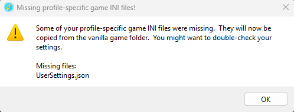

## 3.2 GRAPHIC MODS Separator
- Pick the options for your hardware. Current options are for my mid tier computer.  

### 3.2.1 Nova Rain and Dirt Begone
- Select Nova Rain and Dirt Begone for your system.  
Only one of the two options for each mod should be enabled at any given time.
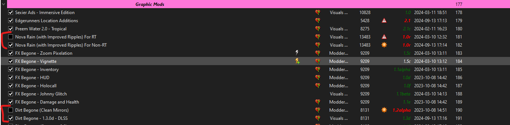

## 3.3 CAR MODS Separator

### 3.3.1 Controller or KBM
- Select one option here depending if you use a controller or not.  
**__I don't give any support for controllers so you will need to look up how to use the mod.__**  
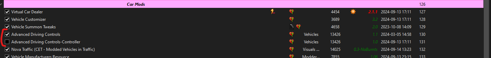

## 3.4 V MAKE OVER OPTIONS Separator

### 3.4.1 EKT Character Creator
- **__In the V MAKE OVER MODS separator__**, select which version of EKT you want to use.  
Only one of the two options should be enabled at any given time.  
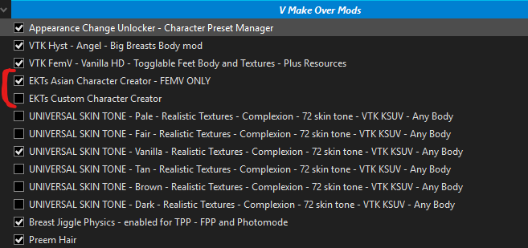

### 3.4.2 Body Textures
- Select **__one__** of the eye replacers.  
Only one of the options should be enabled at any given time.  
**__IF YOU WANT TO USE OVERLAYS YOU NEED TO USE THE VANILLA OPTION!__**  
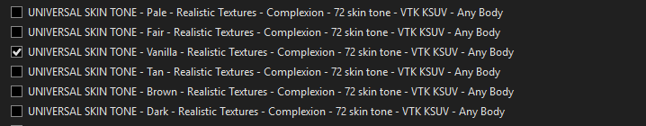

### 3.4.3 Eye Colour Replacers
- Choose one option for the eye colour replacers.  
Only one of the options should be enabled at any given time.  
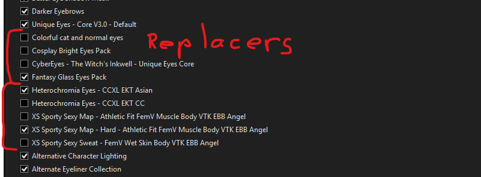

### 3.4.2 Eyes 3D Replacers 
- For each of these groups select whatever mod corresponds to the [EKT](#323-ekt-character-creator) choice you made above.  
Only one of the options should be enabled at any given time.  
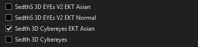  
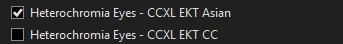  
<!--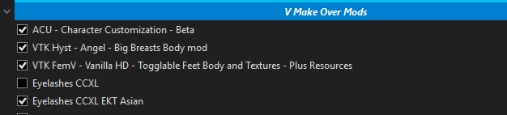  -->

### 3.4.3 Muscle / Sweat options
- Choose one option for your desired body.  
Only one of the options should be enabled at any given time.  
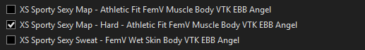  

## 3.5 BODY REPLACERS Separator

### 3.5.1 Overlays and Tattoos
- If you are a new user skip this step
- Go read ["How to use Tattoos and Body overlays"](AdvancedFeatures.md#2-tattoos-and-overlays)
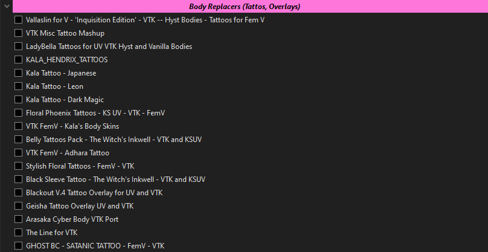

# Continue
If you are done with configuring Mod Manager, you finally get to start the game for the [ingame Mod setup](ModSetup.md).
