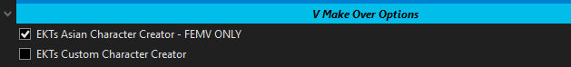

[ <a href="https://github.com/Gallahorn/Ultraviolence/blob/main/README.md">Getting Started</a> ]
[ <a href="https://github.com/Gallahorn/Ultraviolence/blob/main/Installation.md">Installation</a> ]
[ After Install ]
[ <a href="https://github.com/Gallahorn/Ultraviolence/blob/main/ModSetup.md">Mod Setup</a> ]
[ <a href="https://github.com/Gallahorn/Ultraviolence/blob/main/AdvancedFeatures.md">Advanced Features</a> ]
[ <a href="https://github.com/Gallahorn/Ultraviolence/blob/main/Gameplay.md">Gameplay</a> ] 

# Post Installation
These steps will guide you through selecting the correct mods for your PC setup in MO2.

# Contents
- [Post Installation](#post-installation)
- [Contents](#contents)
- [3 Post installation instructions](#3-post-installation-instructions)
  - [3.1 Start Mod Organizer](#31-start-mod-organizer)
  - [3.2 Options in MO2](#32-options-in-mo2)
    - [3.2.1 Nova Rain and Dirt Begone](#321-nova-rain-and-dirt-begone)
    - [3.2.2 Controller or KBM](#322-controller-or-kbm)
    - [3.2.3 EKT Character Creator](#323-ekt-character-creator)
    - [3.2.4 Body Textures](#324-body-textures)
    - [3.2.5 Overlays and Tattoos](#325-overlays-and-tattoos)
- [Continue](#continue)

# 3 Post installation instructions
After you finished your installation, it's time to customize the list for your pc.

## 3.1 Start Mod Organizer
- Open the program by starting ModOrganizer.exe
- On first run, you may see the following message when MO2 is copying your settings for the first time.  
This is normal and the message can be disregarded.  

## 3.2 Options in MO2
- Pick the options for your hardware. Current options are for my mid tier computer.  

### 3.2.1 Nova Rain and Dirt Begone
- Select Nova Rain and Dirt Begone for your system.  
Only one of the two options for each mod should be enabled at any given time.

### 3.2.2 Controller or KBM
- Select one option here depending if you use a controller or not.  
**__I don't give any support for controllers so you will need to look up how to use the mod.__**  

### 3.2.3 EKT Character Creator
- Select which version of EKT you want to use.  
Only one of the two options should be enabled at any given time.  

### 3.2.4 Body Textures
- Select one of the versions.  
Only one of the options should be enabled at any given time.  
**__IF YOU WANT TO USE OVERLAYS YOU NEED TO USE THE VANILLA OPTION!__**  

### 3.2.5 Overlays and Tattoos
- If you are a new user skip this step
- Go read ["How to use Tattoos and Body overlays"](AdvancedFeatures.md#2-tattoos-and-overlays)

# Continue
If you are done with configuring Mod Manager, you finally get to start the game for the [ingame Mod setup](ModSetup.md).