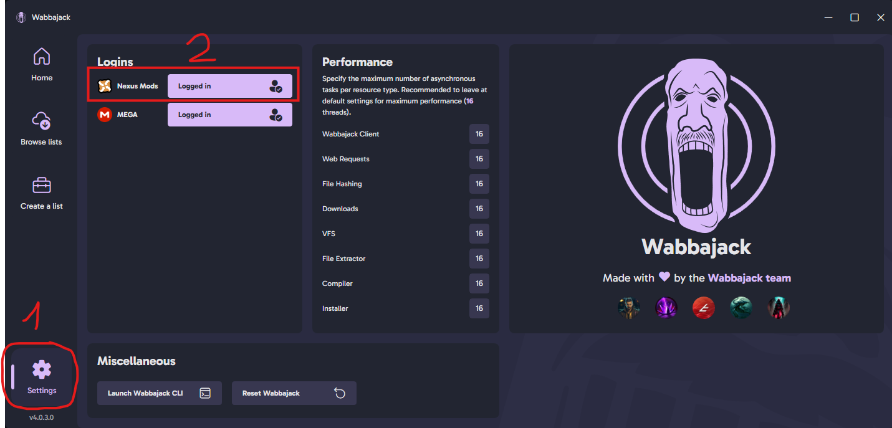
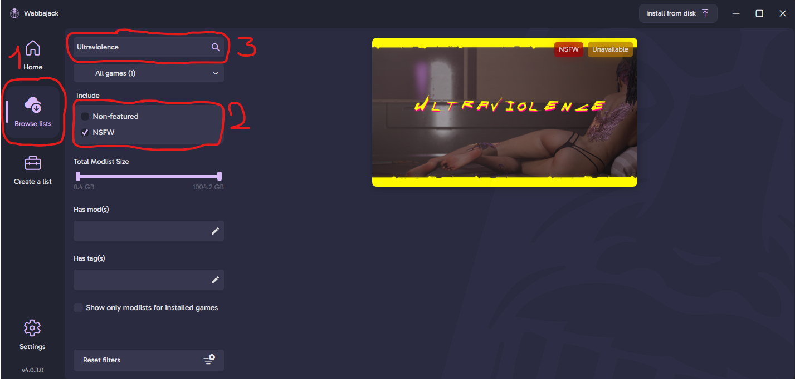
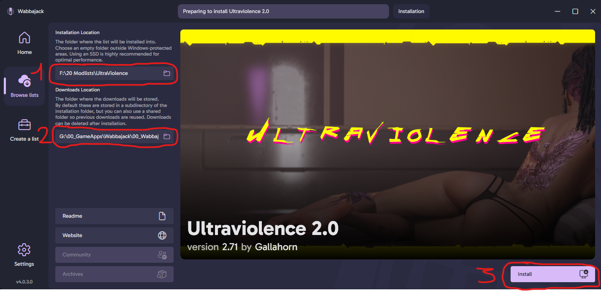
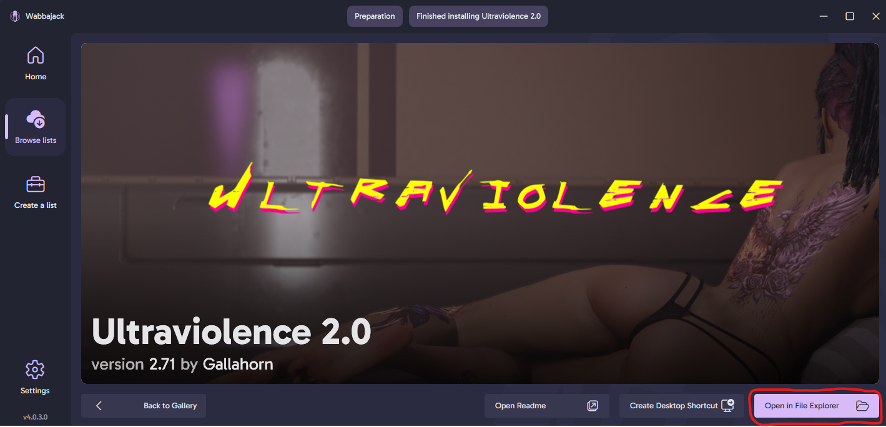

# README

Current Version 3.00: [Changelog](https://github.com/Gallahorn/Ultraviolence/blob/main/Changelog.md)
  
Current list of included mods: [Mod List](https://loadorderlibrary.com/lists/ultraviolence)
  
Wabbajack Cyberpunk 2077 modlist that is focused on gameplay and roleplay.

# Contents

- [Contents](#contents)
- [Need Support?](#need-support)
    - [Asking for support in Discord](#asking-for-support-in-discord)
- [Install instructions](#install-instructions)
    - [1. Make a clean Cyberpunk installation](#1-make-a-clean-cyberpunk-installation)
    - [2. Download Wabbajack](#2-download-wabbajack)
    - [3. Wabbajack settings](#3-wabbajack-settings)
    - [4. Install UltraViolence](#4-install-ultraviolence)
    - [5. Start ModOrganizer](#5-start-mod-organizer)
- [After installation setup](#after-installation-setup)
    - [6. Options in MO2](#6-options-in-mo2)
      - [6.1 Nova Rain and Dirt Begone](#61-nova-rain-and-dirt-begone)
      - [6.2 Controller or Keyboard and Mouse](#62-controller-or-kbm)
      - [6.3 EKT Character Creator](#63-ekt-character-creator)
      - [6.4 Body Textures](#64-body-textures)
      - [6.5 Overlays and Tattoos](#65-overlays-and-tattoos)
- [First game start](#first-game-start)
    - [7. Run the game](#7-run-the-game)
      - [7.1 CET Keybinds](#71-cet-keybinds)
      - [7.2 Ingame settings](#72-ingame-settings)
    - [8. Now you can start a new game](#8-now-you-can-start-a-new-game)
      - [8.1 When you are ingame](#81-when-you-are-ingame)
    - [9. ALL DONE!](#9-all-done)

# Need Support?

Before asking for support, please read the available documentation and do your own research, for example by using the search function in discord before asking a question, because it is likely that your question has been answered before.

## Asking for support in Discord
If you want to ask for support in Discord (join the iAmMe Discord [here](https://discord.gg/iammodlist)), grab the "Ultraviolence" role in onboarding or in "Channels & Roles" at the top of the channel list.
Please make sure to ask your question in the appropriate channel_

- uv-general -> General discussion about the list or included mods.
- uv-modify -> Support-Channel for non-vanilla UV installs (if you changed files, added or deleted mods in your UV install, ask for support here).
- uv-support -> Support-Channel for vanilla (unchanged) UV installs.

# Install instructions
Screenshots below assume the Steam version of the game. For GoG, see [Install with GOG version](Advanced%20features.md#installation-with-gog-version) and then continue with the Wabbajack steps below.

## 1. Make a clean cyberpunk installation
> [!WARNING]
> Make sure ***NOT to install*** the base game or modlist ***in a protected folder***!  
> 

- Follow [these instructions](https://support.cdprojektred.com/en/cyberpunk/pc/sp-technical/issue/2233/how-do-i-perform-a-clean-install-of-the-game) to make sure you have a clean fresh install of Cyberpunk
- Make sure you have ***all DLC installed***, as puctured below.  
***YOU NEED Phantom Liberty and REDmod to install this modlist.***

> [!TIP]
> If you don't have it yet, you can grab [Redmod here](https://store.steampowered.com/app/2060310/Cyberpunk_2077_REDmod/).

- After you have finished verifying your game, launch it from steam and enable mods in the REDlauncher.

- Once the game has loaded, in the settings under gameplay, ***turn off analytics and crossplatform saves***.

## 2. Download Wabbajack 
- Grab the newest version of [Wabbajack](https://www.wabbajack.org/).       

- Start Wabbajack.

## 3. Wabbajack settings
- In Wabbajack, click the settings button and log in to your nexus account.

## 4. Install UltraViolence
- Click the "Browse lists" button and select the "NSFW" option on the left side.
- In the top box, search for "ultraviolence" and once it shows up on the right side, click on it.

- Select your ***installation folder*** and ***downloads folder*** as you desire (outside of protected folders as mentioned above).

> [!WARNING]
> Make sure to select your installation folder to be ***ON THE SAME DRIVE*** as your Cyberpunk installation.

> [!TIP]
> We recommend, to keep your downloads folder ***outside*** of your installation folder.  
> Because this is just storage, it can be placed anywhere else, even on a slower hard drive if space is a concern. Having a separate download folder means your downloads won't be wiped when you reinstall or update the modlist, and makes updating faster when you don't have to redownload the required mods.  
>  
> Your final folder setup may look something like this:  
> -   D:\Cyperpunk2077\    (your base game path, in a non-protected folder)
> -   D:\Ultraviolence\    (actual modlist install, preferably on the same drive as your game)
> -   D:\ultraviolence-downloads\    (your separate downloads location, used for storage)
- Hit install and wait until the "Installation finished" screen appears.
- On this screen, select "Open in File Explorer".

## 5. Start Mod Organizer
- Open the program by starting ModOrganizer.exe
- On first run, you may see the following message when MO2 is copying your settings for the first time.  
This is normal and the message can be disregarded.  

# After installation setup
After you finished your installation, it's time to customize the list for your pc.

## 6. Options in MO2
- Pick the options for your hardware. Current options are for my mid tier computer.  
If you are interested in what performance to expect, you can see my benchmarks [here](Performance.md).

### 6.1 Nova Rain and Dirt Begone
- Select Nova Rain and Dirt Begone for your system.  
Only one of the two options for each mod should be enabled at any given time.

### 6.2 Controller or KBM
- Select one option here depending if you use a controller or not.  
I don't give any support for controllers so you will need to look up how to use the mod.

### 6.3 EKT Character Creator
- Select which version of EKT you want to use.  
Only one of the two options should be enabled at any given time.  

### 6.4 Body Textures
- Select one of the versions  
Only one of the options should be enabled at any given time.
**__IF YOU WANT TO USE OVERLAYS YOU NEED TO USE VANILLA OPTION__**  

### 6.5 Overlays and Tattoos
- If you are a new user skip this step
- Go read ["How to use Tattoos and Body overlays"](https://github.com/Gallahorn/Ultraviolence/blob/main/Advanced%20features.md#how-to-use-tattoos-and-body-overlays)

# First game start

## 7. Run the game
- Run the launcher and make sure mods are enabled and also ***don't ever touch the unlock button***!

## 7.1 CET Keybinds
- When you start the game CET will popup and want you to pick a hotkey for its menu.  
CET is an important mod, so make the hotkey pretty easy to access. I have mine set next to the Enter key.

- When you arrive at the "Press space to continue" screen hit the CET to open the menu.  
Go to [keybinds section](https://github.com/Gallahorn/Ultraviolence/blob/main/Advanced%20features.md#keybinds) and look up what you need to bind in CET.

# 7.2 Ingame settings
- Make sure you have Texture Quality set to High in the settings.  
> [!WARNING]
> You can only change this in the main menu before loading a game.  
> If you don't set the Textures to High, you will have weird textures on arms/body/faces.  

- Make sure you unbind or rebind "Cycle Weapon" under Key Bindings.

- You need to take a look at [Advanced Features](https://github.com/Gallahorn/Ultraviolence/blob/main/Advanced%20features.md)
    before you play.  
    Most important is to look over the keybind section.

# 8. Now you can start a new game!

## 8.1 When you are ingame
- Open CET and pick a LUT you like with LUT SWITCHER  

- Take a look [here](https://github.com/Gallahorn/Ultraviolence/blob/main/Advanced%20features.md#how-to-unlock-romance-options) how to enable Panam Romance as Female V.

- Visit H10 apartment after new install or update and watch the TV in the apartment.

- Dont EVER equip modded clothes in vanilla slots. Use wardrobe function for everything modded.

# 9. ALL DONE!
You're done.  
Congratulations.  

Have a great adventure in Cyberpunk and enjoy your stay with UltraViolence!

<!-- ~~## 12. Go back to MO2 and click and choose Wolvenkit and hit run.~~

~~~~

  ~~### In wolvenkit you do the following~~

    1. Click Mod Manager
    2. Click Refresh
    3. Check all the mods
    4. Click deploy
    5. Close Wolvenkit if it was sucessfull
~~~~

~~~~

-->

<!--  ### Huditor
    Make sure you pick the right resolution between 1080p and 1440p. If you are playing at 4k pick 1440p
    and then look in the keybind section on how to move the hud around. 

-->
