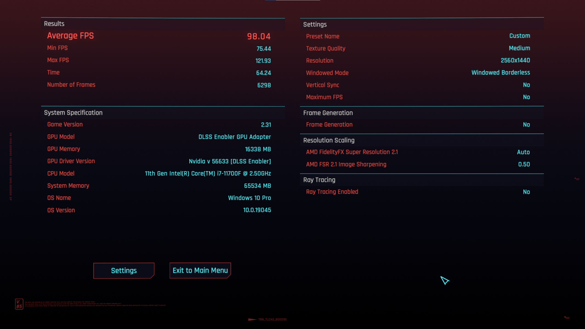
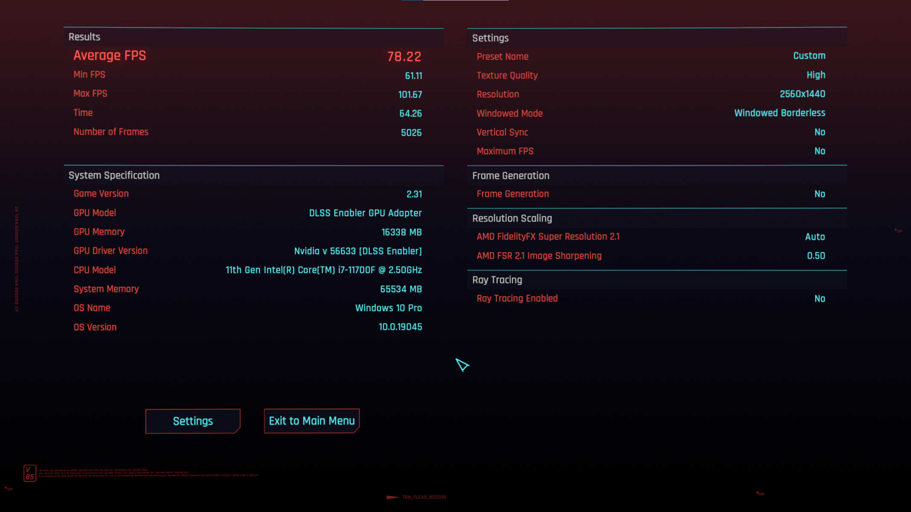
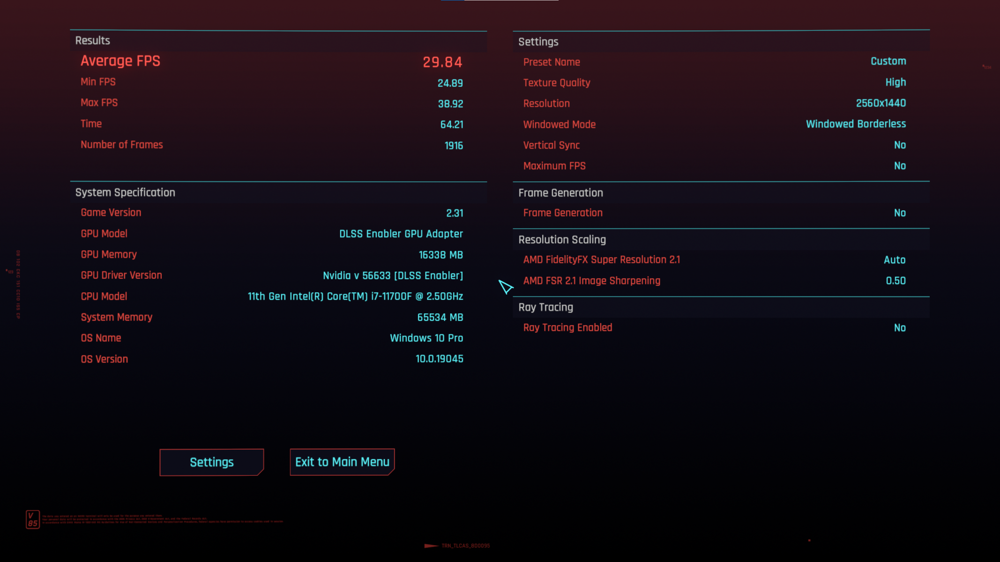

# Performance
In this file you will find some benchmark numbers of a variety of systems, so you are able to gauge on how good the modlist will run for you.  
Hardware details for each system will be provided in each section.  

As the landscape of current hardware is ever shifting, we will refrain from labelling system as low- or high-end etc.

> [!TIP]
> The presets will say "custom" on these benchmarks because the "Textures" slider has to remain on "high" for certain mods to work properly, even when in lower presets.

# Contents
- [Performance](#performance)
- [Contents](#contents)
  - [System 1 (i7-11700F, RX 6800, 32GB, 1440p)](#system-1-i7-11700f-rx-6800-32gb-1440p)
    - [System 1: No Raytracing](#system-1-no-raytracing)
    - [System 1: With Raytracing](#system-1-with-raytracing)
        

## System 1 (i7-11700F, RX 6800, 32GB, 1440p)
System specs:
- CPU: 11th Gen Intel i7-11700F
- GPU: RX 6800 16GB
- RAM:  DDR4 2x32GB
- Resolution: 2560x1440

### System 1: No Raytracing
Low

Medium

High

Ultra

### System 1: With Raytracing
Low

Medium

High

Overdrive  
No "overdrive" data was provided because the setting cause a crash for them.  